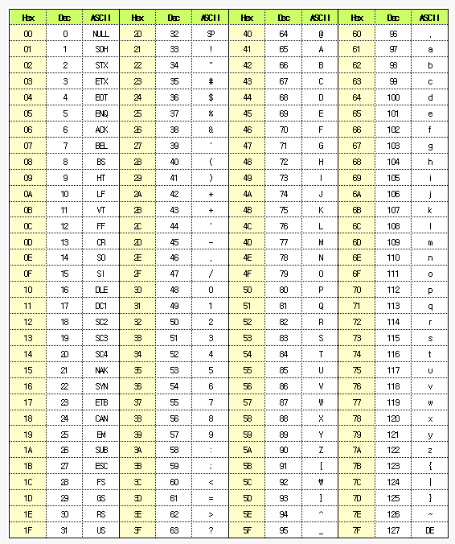

# 2023.02.17

# APS 기본 - String 문자열

## 문자열

### 컴퓨터에서의 문자표현

### ASCII Code 아스키 코드



- 글자 A를 메모리에 저장하는 방법에 대해 생각해보자
- 영어가 대소문자 합쳐서 52이므로 6(64가지)비트면 모두 표현할 수 있다. 이를 코드체계라고 한다. - 000000 → ‘a’, 000001 → ‘b’
- 그런데 네트워크가 발전되기 전 미국의 각 지역 별로 코드체계를 정해 놓고 사용했지만
- 네트워크(인터넷: 인터넷은 미국에서 발전했다)이 발전하면서 서로간에 정보를 주고 받을 때 정보를 달리 해석한다는 문제가 생겼다.
- 그래서 혼동을 피하기 위해 표준안을 만들기로 했다.
- 이러한 목적으로 1967년, 미국에서 ASCII(American Standard Code for Information Interchange)라는 문자 인코딩 표준이 제정되었다.
- ASCII는 7bit 인코딩으로 128문자를 표현하며 33개의 출력 불가능한 제어 문자들과 공백을 비롯한 95개의 출력 가능한 문자들로 이루어져 있다.
- 출력 가능 아스키 문자(32 ~ 126)
    - 0 : 48, A : 81, a: 97

### Unicode 유니코드

- 인터넷이 전 세계로 발전하면서 ASCII를 만들었을 때의 문제와 같은 문제가 국가간에 정보를 주고 받을 때 발생.
- 자국의 코드체계를 타 국가가 가지도 있지 않으면 정보를 잘못 해석 할 수 밖에 없었음.
- 그래서 다국어 처리를 위해 표준을 마련했다. 이를 유니코드라고 함.
- 유니코드도 다시 Character Set으로 분류됨
- 유니코드 인코딩 (UTF : Unicode Transformation Format)
    - UTF-8 (in web)
        - MIN : 8bit, Max : 32bit(1 Byte * 4)
    - UTF-16(in windows, java)
        - MIN : 16bit, Max : 32bit(2 Byte * 2)
    - UTF-32(in unix)
        - MIN : 32bit, Max : 32bit(4 Byte * 1)
        

### java에서 String 클래스에 대한 메모리 배치

- 기본적인 객체 메타 데이터 외에도 네 가지 필드들이 포함되어있음.
- hash값, 문자열의 길이(count), 문자열 데이터의 시작점(offset), 실제 문자열 배열에 대한 참조(value)

### Java(객체지향 언어)에서의 문자열 처리

- 문자열 데이터를 저장, 처리해주는 클래스 제공
- String클래스 사용
    
    ```java
    String str = "abc";
    String str = new String("abc");
    ```
    
- 문자열 처리에 필요한 연산을 연산자, 메소드 형태로 제공
    - +, length(), replace(), split(), substring() …
    - 보다 풍부한 연산을 제공한다

### C와 Java의 String 처리의 기본적인 차이점

- c는 아스키 코드로 저장
- java는 유니코드(UTF16, 2byte)로 저장
- 파이썬은 유니코드(UTF8)로 저장

### 문자열 뒤집기

- 자기 문자열에서 뒤집는 방법
    - swap을 위한 임시 변수가 필요하며 반복 수행을 문자열 길이의 반만을 수행해야 한다.
- 새로운 빈 문자열을 만들어 소스의 뒤에서부터 읽어서 타겟에 쓰는 방법

### 문자열 비교⭐⭐⭐

- c strcmp() 함수를 제공한다
- Java에서는 equals() 메소드를 제공한다
    - 문자열 비교에서 == 연산은 메모리 참조가 같은지를 물어보는 것(객체 주소비교)

```java
String str1 = "Hi";
String str2 = "Hello";
if(str1.equals(str2)==true){
	System.out.println("Equal");
}
```

- 숫자 클래스의 parse 메소드를 제공한다
    - Integer.parseInt(String)
    - 역함수로는 toStrinig() 메소드 제공
- **atoi()** : 문자열 → 정수

```java
int atoi(char[] charArr){
	int value = 0;
	int digit;
	for(int i = 0; i < charArr.length; i++){
		if(charArr[i] >= '0' && charArr[i] <= '9')
			digit = charArr[i] - '0'; ⭐⭐
		else {
			break;
		}
		value = (value * 10) + digit;
	}
	return value;
}
```

- BufferedReader `br.readLine()` ⇒ 줄단위 // `StringTokenzier` ⇒ 토큰
- Scanner [`sc.next](http://sc.next)() nextInt()` ⇒ 토큰 // `nextLine()` ⇒ 줄단위
    - 줄단위, 토큰단위 일관되게 사용하기. 둘 다 사용해야할 시 줄단위로 기본.
    

## 패턴 매칭

### 패턴 매칭에 사용되는 알고리즘

- 고지식한 패턴 검색 알고리즘 → Brute force⭐
    - 본문 문자열을 처음부터 끝까지 차례대로 순회하면서 패턴 내의 문자들을 일일이 비교하는 방식으로 동작
    - 최악의 경우 시간 복잡도는 텍스트의 모든 위치에서 패턴을 비교해야하므로 O(MN)이 됨
    - 비교 횟수를 줄일 수 있는 방법은 없는가?
    
    ```java
    for(i = 0; i < n-m+1; i++){
    	for(j = 0; j < m; j++){
    		if(p[j] != t[i+j]){
    			flag <- false
    			break;
    		}
    		if(flag) return i;
    	} return -1;
    	
    }
    ```
    
- 의사코드

```java
// p[] : 찾을 패턴 - iss
// t[] : 전체 텍스트 - This iss a book
// M : 찾을 패턴의 길이
// N : 전체 텍스트의 길이
// i : t의 인덱스
// j : p의 인덱스

BruteForce(char[] p, char[] t){
	i ← 0, j ← 0
	while(j < M and i < N) {
		if(t[i] != p[j]) // i번째와 j번째가 일치하지 않는다면
			i ← i - j; ⭐ // 늘어난 만큼 다시 빼줘야 되돌아감
			j ← -1; ⭐ // i는 한칸씩 전진, j는 0이 된다
		i ← i + 1, i ← j + 1 ⭐⭐⭐ // i와 j가 동시에 늘어남. while문의 특징
	}
	if(j == M) return 1 - M;
	else return -1;
}
```

- 카프-라빈 알고리즘
- KMP 알고리즘
- 보이어-무어 알고리즘
    - 오른쪽에서 왼쪽으로 비교
    - 대부분의 상용 소프트웨어에서 채택하고 있는 알고리즘
    - 패턴의 오른쪽 끝에 있는 문자가 불일치하고 이 문자가 패턴 내에 존재하지 않는 경우, 이동거리는 무려 패턴의 길이 만큼이 된다.

### 시저 암호(Caesar cipher)

- 줄리어스 시저가 사용했다고 하는 암호
- 시저는 기원전 100년경에 로마에서 활약했던 장군
- 시저 암호에서는 평문에서 사용되고 있는 알파벳을 일정한 문자 수만큼[평행이동] 시킴으로써 암호화를 행한다.

### bit열의 암호화

- 배타적 논리합(exclusive-or)연산 사용
