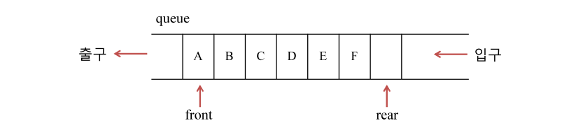

# 2023.02.22

# APS기본 - 스택(Stack) & 큐(Queue)

## 큐(Queue)

### 큐의 특성

- 스택과 마찬가지로 삽입과 삭제의 위치가 제한적인 구조자료
    - 큐의 뒤에서는 삽입만 하고, 큐의 앞에서는 삭제만 이루어지는 구조
- 선입선출구조(FIFO : First In First Out)
    - 큐에 삽입한 순서대로 원소가 저장되어, 가장 먼저 삽입(First In된 원소는 가장 먼저 삭제(First Out)된다.

### 큐의 선입선출 구조



- 머리(Front) : 마지막으로 ***삭제된*** 원소
    - 가장 첫번째 원소의 한 칸 앞 index
- 꼬리(Rear) : 저장된 원소 중 마지막 원소
- `front = - 1` `rear = - 1` 인덱스는 보통 -1로 초기화

### 큐의 기본 연산

- 삽입 : enQueue
- 삭제 : deQueue

### 큐의 사용을 위해 필요한 주요 연산

| 연산 | 기능 |
| --- | --- |
| enQueue(item)  | 큐의 뒤쪽(rear 다음)에 원소를 삽입하는 연산 ⭐ |
| deQueue() | 큐의 앞쪽(front)에서 원소를 삭제하고 반환하는 연산 ⭐ |
| createQueue() | 공백 상태의 큐를 생성하는 연산 |
| isEmpty()  | 큐가 공백상태인지를 확인하는 연산 |
| isFull() | 큐가 포화상태인지를 확인하는 연산 |
| Qpeek() | 큐의 앞쪽(front)에서 원소를 삭제 없이 반환하는 연산 |

### 큐의 연산 과정

1. 공백 큐 생성 :  `createQueue();`


1. 원소 A 삽입 : `enQueue(A);`


1. 원소 B 삽입 : `enQueue();`


1. 원소 반환 / 삭제 : `deQueue();`
    1. enQueue → `rear++`
    2. deQueue → `front++`


1. 원소 C 삽입 : `enQueue();`


1. 원소 반환 / 삭제 : `deQueue();`


1. 원소 반환 / 삭제 : `deQueue();`
    1. front와 rear가 같으면 큐는 비어있는 것
    
    
    

## 선형 큐 (Linear Queue)

### 1차원 배열을 이용한 큐

- 큐의 크기 = 배열의 크기 = 원소의 개수 `size()`
- front : 마지막으로 삭제된 인덱스 ( 배열에서 큐의 첫번째 원소의 idx - 1)
- rear : 저장된 마지막 원소의 인덱스

### 상태 표현 ⭐⭐

- 초기 상태 : front = rear = -1
- 공백 상태 : front = rear
- 포화 상태 : rear = n - 1 (n : 배열의 크기, n - 1: 배열의 마지막 인덱스)

### 초기 공백 큐 생성

- 크기 n인 1차원 배열 생성
- front와 rear를 -1로 초기화

### 삽입 : `enQueue(item)`

- 마지막 원소 뒤에 새로운 원소를 삽입하기 위해
    - rear 값을 하나 증가시켜 새로운 원소를 삽입할 자리 마련
    - 그 인덱스에 해당하는 배열원소 `Q[rear]`에 item을 저장

```java
enQueue(item) {
	if(isFull()) print("Queue_Full")
	else {
		rear <- rear + 1;
		Q[rear] <- item;
	}
}
```

### 삭제 : `deQueue()`

- 가장 앞에 있는 원소를 삭제하기 위해
    - front 값을 하나 증가시켜 큐에 남아있는 첫 번째 원소 이동
    - 새로운 첫 번째 원소를 리턴함으로써 삭제와 동일한 기능함

```java
deQueue() {
	if(isEmpty()) print("Queue_Empty")
	else {
		front <- front + 1; // 먼저 삭제를 하고
		return Q[front]; // 삭제된 원소를 리턴
		// front는 마지막으로 삭제된 원소, front + 1 첫번째로 삭제된 원소
	}
}
```

### 공백상태 및 포화상태 검사 : `isEmpty()` `isFull()`

- 공백상태 : front = rear
- 포화상태 : rear = n - 1 (n : 배열의 크기, n - 1 : 배열의 마지막 인덱스)

```java
isEmpty() {
	if(front == rear) return true;
	else return false;
}
isFull() {
	if(rear == n - 1) return true;
	else retrun false;
}
```

### 검색 : `Qpeek()`

- 가장 앞에 있는 원소를 검색하여 반환하는 연산
- 현재 front의 한자리 뒤 (front +1)에 있는 원소, 즉 큐의 첫 번째에 있는 원소를 반환 ⭐

```java
QpeeK() {
	if(isEmpty()) print("Queue_Empty");
	else return Q[front + 1]
}
```

### 잘못된 포화상태 인식

- 선형 큐를 이용하여 원소의 삽입과 삭제를 계속할 경우, 배열의 앞부분에 활용할 수 있는 공간이 있음에도 불구하고, rear = n - 1 인 상태 즉, 포화상태로 인식하여 더 이상의 삽입을 수행하지 않게 됨

### 해결방법 1

- 매 연산이 이루어질 때마다 저장된 원소들을 배열의 앞부분으로 모두 이동시킴 ⭐
- 원소 이동에 많은 시간이 소요되어 큐의 효율성이 급격히 떨어짐

```java
public static int deQueue() {
		if(isEmpty()) { // 큐가 비어있다면 삭제 불가
			System.out.println("큐가 비어있어서 deQueue 안됨.");
			return -1;
		} else {
			// front를 늘리는 것이 아니라..
			// rear를 앞으로 당긴다.
			int temp = arr[front + 1]; // 임시변수에다가 현재 가장 앞에 있는 원소 저장
			// 모든 원소를 한 칸 앞으로 당기면서 덮어쓰기 한다
			for(int i = 0; i < rear; i++) {
				arr[i] = arr[i + 1];
			}
			rear--; // 삭제 완료
			
			// 삭제 원소를 반환
			return temp;
		}
	}
```

### 해결방법 2

- 1차원 배열을 사용하되, 논리적으로는 배열의 처음과 끝이 연결되어 원형 형태의 큐를 이룬다고 가정하고 사용
- 원형 큐의 논리적 구조
