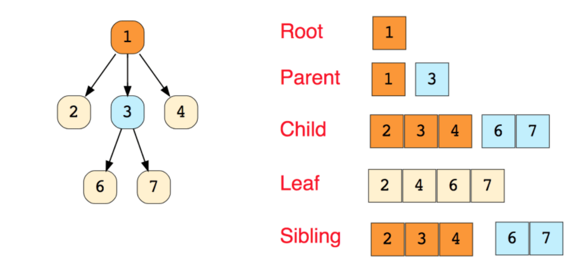

# 2023.02.28

# APS기본 - 트리(Tree)

## 트리

### 트리의 개념

- 비선형 구조
- 원소들 간에 *1 : N 관계*를 가지는 자료구조 ⭐
    - 나의 자식은 둘 이상의 부모가 있을 수 없음
- 원소들 간에 *계층관계*를 가지는 계층형 자료구조 ⭐
- 상위 원소에서 하위 원소로 내려가면서 확장되는 트리(나무)모양의 구조

```
**트리의 조건**
1. 부모 : 자식 = 1 : N
2. 하나의 자식을 둘 이상의 부모 X
3. 노드의 개수가 N개 -> 간선의 개수 N - 1개
4. 원소가 하나이거나 비어 있어도 트리 O
5. 사이클 있으면 X
```

<br>

<br>

### 한 개 이상의 노드로 이루어진 유한 집합이며 다음 조건을 만족한다

- 노드 중 최상위 노드를 루트(root)라 한다. : 자식만 있고 부모가 없다
- 나머지 노드들은 n(≥0)개의 분리집합 T1… TN으로 분리될 수 있다.
    - 간선을 끊을 수 있음

<br>

<br>

### 이들 T1, …, TN은 각각 하나의 트리가 되며(재귀적 정의) 루트의 부 트리(subtree)라 한다.



```
단말노드 : external node
  ㄴ 자식의 수 : 0개

↕

internal node
  ㄴ 자식의 수 : 1개 이상
```

<br>

<br>

### 노드(node) - 트리의 원소

- 트리 T의 노드 - A, B, C, D, E, F, G, H, I ,J ,K

### 간선(edge)- 노드를 연결하는 선, 부모 노드와 자식 노드를 연결

- 위계, 방향성
- 경로 path : 간선들로 연결된 노드를 순서대로 나열한 것.
- 거리 : 간선의 수

```
A -> B -> F -> K
 -> 개수 : 3개 = 거리 3
```


<br>

<br>

### 루트 노트(root node) - 트리의 시작 노드

- 트리 T의 루트 노드 - A

<br>

<br>

### 형제 노드 (sibling node) - 같은 부모 노드의 자식 노드들

- B, C, D는 형제 노드

<br>

<br>

### 조상 노드 - 간선을 따라 루트 노드까지 이르는 경로에 있는 모드 노드들

- L의 조상 노드 : F, B, A

<br>

<br>

### 서브 트리 (subtree) - 부모 노드와 연결된 간선을 끊었을 때 생성되는 트리

<br>

<br>

### 자손 노드 - 서브 트리에 있는 하위 레벨의 노드들

- B의 자손 노드 : E, F, K, L

<br>

<br>

### 차수(degree)

- 노드의 차수 : 노드에 연결된 자식 노드의 수
    - B의 차수 = 2, C의 차수 = 1
- 트리의 차수 : 트리에 있는 노드의 차수 중에서 가장 큰 값
    - 트리 T의 차수 = 3
- 단말 노드(리프 노드) : 차수가 0인 노드. 즉, 자식 노드가 없는 노드

<br>

<br>

### 높이(height) & 깊이(depth)

- 노드의 높이 : 루트(말단 노드)에서 노드에 이르는 간선의 수(가장 긴 거리). 노드의 레벨
    - B의 높이 = 1, F의 높이 = 2
- 트리의 높이 : 트리에 있는 노드의 높이 중에서 가장 큰 값. 최대 레벨
    - 트리 T의 높이 = 3 = 깊이 = 레벨

<br>

<br>

<br>

## 이진트리

### 모든 노드들이 2개의 서브 트리를 갖는 특별한 형태의 트리

### 각 노드가 자식 노드를 최대한 2개 가지만 가질 수 있는 트리 ⭐

- 왼쪽 자식 노드(left child node)
- 오른쪽 자식 노드(right child node)

<br>

<br>

### 이진 트리의 예


<br>

<br>

### 레벨 i에서의 노드의 최대 개수는 2^i개

<br>

<br>

### 높이가 h인 이진 트리가 가질 수 있는 노드의 최소 개수는 (h+1)개가 되며, 최대 개수는 (2^h+1)-1개

<br>

<br>

### 포화 이진 트리(Full Binary Tree)


- 모든 레벨에 노드가 포화상태로 차 있는 이진 트리
- 높이가 h일 때, 최대의 노드 개수인 (2^h+1)-1 의 노드를 가진 이진 트리
    - 높이가 3일 때  (2^3+1)-1 = 15개의 노드
- 루트를 1번으로 하여  (2^h+1)-1까지 정해진 위치에 대한 노드 번호를 가짐

<br>

<br>

### 완전 이진 트리(Complete Binary Tree) ⭐⭐⭐


- 높이가  h이고 노드 수가 n개일 때 (단, h+1 ≤ n ≤  (2^h+1)-1 ), 포화 이진 트리의 노드 번호 1번부터 n번까지 빈 자리가 없는 이진 트리
    - 마지막 레벨 빼고 모든 레벨이 다 차있어야함.
    - 마지막 레벨은 왼쪽부터 채워야함
- 예 ) 노드가 10개인 완전 이진 트리

<br>

<br>

### 배열을 이용한 이진 트리의 표현


- 이진 트리에게 각 노드 번호를 다음과 같이 부여
- 루트의 번호를 1로 함
    - 노드 번호를 배열의 인덱스로 사용 (1번부터)
- 레벨 n에 있는 노드에 대하여 왼쪽부터 오른쪽으로 2^n 부터 2(^n+1)-1까지 번호를 차례대로 부여

<br>

<br>

### 노드 번호의 성질 ⭐

- 노드 번호가 i인 노드의 부모 노드 번호? `i/2`
- 노드 번호가 i인 노드의 왼쪽 자식 노드 번호? `2*i`
- 노드 번호가 i인 노드의 오른쪽 자식 노드 번호? `2*i+1`
- 레벨 n의 노드 번호 시작 번호는? `2n`

<br>

<br>

### 편향 이진 트리(Skewed Binary Tree)


- 높이 h에 대한 최소 개수의 노드를 가지면서 한쪽 방향의 자식 노드만을 가진 이진 트리
    - 왼쪽 편향 이진 트리
    - 오른쪽 편향 이진 트리

<br>

<br>

### 배열을 이용한 이진 트리의 표현의 단점

- 편향 이진 트리의 경우에 사용하지 않는 배열 원소에 대한 메모리 공간 낭비 발생
- 트리의 중간에 새로운 노드를 삽입하거나 기존의 노드를 삭제할 경우 배열의 크기 변경이 어려워 비효율적

### 배열을 이용한 이진 트리의 표현의 단점을 보완하기 위해 연결리스트를 이용하여 트리를 표현할 수 있다.

### 연결 자료구조를 이용한 이진트리의 표현

- 이진 트리는 모든 노드는 최대 2개의 자식 노드를 가지므로 일정한 구조의 단순 연결 리스트 노드를 사용하여 구현

### 순회(traversal)란 트리의 각 노드를 중복되지 않게 전부 방문(visit)하는 것을 말하는데 트리는 비 선형 구조이기 때문에 선형구조에서와 같이 선후 연결 관계를 알 수 없다.

<br>

<br>

### 순회(traversal) : 트리의 노드들을 체계적으로 방문하는 것

### 3가지의 기본적인 순회방법

- 전위 순회 (preorder traversal) : VLR
    - 부모 노드 방문 후, 자식 노드를 좌, 우 순서로 방문한다.
- 중위 순회 (inorder traversal) : LVR
    - 왼쪽 자식 노드, 부모 노드, 오른쪽 자식 노드 순으로 방문
- 후위 순회 (postorder traversal) : LRV
    - 자식 노드를 좌우 순서로 방문한 후, 부모 노드로 방문한다.

<br>

<br>

### 전위 순회(preorder traversal)

- 수행 방법
    - 현재 노드 n을 방문하여 처리 → V
    - 현재 노드 n의 왼쪽 서브 트리로 이동 → L
    - 현재 노드 n의 오른쪽 서브 트리로 이동 → R
- 전위 순회 알고리즘

```java
preorder_travers(T) {
	if( T is not null ) {
		visit(T)
		preorder_travers(T.left)
		preorder_travers(T.right)
	}
}
```

<br>

<br>

### 중위 순회(inorder traversal)

- 수행 방법
    - 현재 노드 n의 왼쪽 서브 트리로 이동한다 : L
    - 현재 노드 n을 방문하여 처리 : V (출력)
    - 현재 노드 n의 오른쪽 서브 트리로 이동 : R
- 중위 순회 알고리즘

```java
inorder_travers(T) {
	if( T is not null ) {
		preorder_travers(T.left)
		visit(T)
		preorder_travers(T.right)
	}
}
```

<br>

<br>

### 후위 순회(postorder traversal)

- 수행 방법
    - 현재 노드 n의 왼쪽 서브 트리로 이동 : L
    - 현재 노드 n의 오른쪽 서브 트리로 이동 : R
    - 현재 노드 n을 방문하여 처리 : V
- 후위 순회 알고리즘

```java
postorder_travers(T) {
	if( T is not null ) {
		preorder_travers(T.left)
		preorder_travers(T.right)
		visit(T)
	}
}
```
