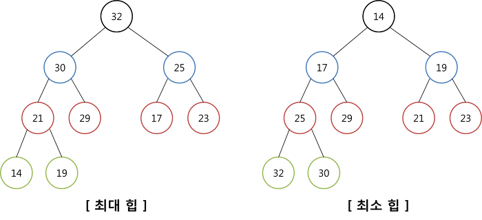

# 2023.03.02

# APS기본 - 트리(Tree)

## 수식 트리

- 수식을 표현하는 이진 트리
- 수식 이진 트리(Expression Binary Tree)라고 부르기도 함
- 연산자는 루트 노드이거나 가지 노드
- 피연산자는 모두 잎 노드 (leaf node , external node)
- 연산의 순서는 밑에서부터 올라간다

 

### 중위 순회 : A / B * C * D + E (식의 중위 표기법)

### 후위 순회 : A B / C * D * E + (식의 후위 표기법)

### 전위 순회 : + * * / A B C D E (식의 전위 표기법)

 

 

## 힙(Heap)

완전 이진 트리에 있는 노드 중에서 키 값이 가장 큰 노드나 키 값이 가장 작은 노드를 찾기 위해서 만든 자료구조

루트가 최대가 되는 힙은 최대힙, 최소면 최소힙

 

### 최대 힙(max heap)

- **키 값이 가장 큰 노드**를 찾기 위한 *완전 이진 트리*
- 부모 노드의 키 값 ≥ 자식 노드의 키 값 (크거나 같아야 함) ⭐⭐
- 루트 노드 : 키 값이 가장 큰 노드 (최대값)

 

### 최소 힙(min heap)

- **키 값이 가장 작은 노드**를 찾기 위한 *완전 이진 트리*
- 부모 노드의 키 값 ≤ 자식 노드의 키 값 (크거나 같아야 함)⭐
- 루트 노드 : 키 값이 가장 작은 노드 (최소값)

 

 

<aside>
💡 이진트리는 `i / 2` = `부모의 개수` , `2 * i` = `왼쪽 자식` , `2 * i + 1` = `오른쪽 자식`

</aside>

 

### 삽입 연산

1. 배열의 가장 마지막에 원소 추가
2. 자식(말단)노드에서 루트노드까지 *힙의 성질을 만족할 때 까지* 부모와 비교(힙이 되는지 확인)
    1. 만족 x  ⇒  현재 자식을 부모와 교환(swap)
    2. 만족 o  ⇒  종료
    3. 재귀적으로 부모 타고 계속 올라감

 

<aside>
💡 현재 힙이 최대힙을 만족하고 있다면 말단 노드에서 루트 노드의 경로 외 손댈 필요 없음
i 개수가 7개라면 `/ 2` 하여 2번만 검사 실행하면 됨

</aside>

 

 

### 삭제

- 힙에서는 루트 노드의 원소만을 삭제할 수 있다
    - 정렬을 이용할 수 있음(우선순위 큐)
- 루트 노드의 원소를 삭제하여 반환한다
- 힙의 종류에 따라 최대값 또는 최소값을 구할 수 있다

 

|  | 삽입 | 삭제 |
| --- | --- | --- |
| 방향 | 리프 → 루트 | 루트 → 리프 |
| 비교 | 부모와 비교해서 올라감 | 두 자식과 비교해서 큰 쪽으로 내려감 |
| 시간복잡도 | log N | 2log N |
|  | O(logN) | O(logN) |
- n개 원소를 힙을 이용해 정렬 ⇒ O(nlogn)

 

## 힙의 활용 1

### 우선순위 큐

<aside>
💡 우선순위 큐를 구현하는 가장 효율적인 방법이 힙을 사용하는 것
- 노드 하나의 추가 / 삭제의 시간 복잡도가 O(logN)이고 최댓값, 최솟값을 O(1)에 구할 수 있다.
- 완전 정렬보다 관리 비용이 적다.

</aside>

- 배열을 통해 트리 형태를 쉽게 구현할 수 있다.
    - 부모나 자식 노드를 O(1)연산으로 쉽게 찾을 수 있다
    - n 위치에 있는 노드의 자식은 `2 * n` 과 `(2 * n) + 1` 에 위치한다
    - 완전 이진 트리의 특성에 의해 추가 / 삭제의 위치는 자료의 시작과 끝 인덱스로 쉽게 판단 가능

 

 

## 힙의 활용 2

### 힙 정렬

- 힙 정렬을 힙 자료구조를 이용해서 이진 트리와 유사한 방법으로 수행된다
- 정렬을 위한 2단계
    - 하나의 값을 힙에 삽입한다.(반복)
    - 힙에서 순차적(오름차순)으로 값을 하나씩 제거한다
- 힙 정렬의 시간복잡도
    - N개의 노드 삽입 연산 + N개의 노드 삭제 연산
    - 삽입과 삭제 연산은 각각 O(logN)이다
    - 따라서 전체 정렬은 O(NlogN)이다
- 힙 정렬은 배열에 저장된 자료를 정렬하기에 유용하다
