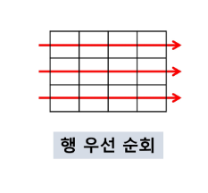
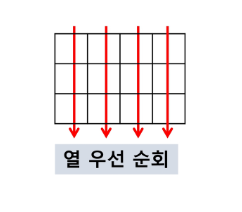
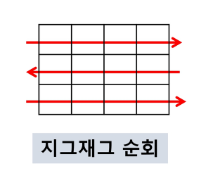
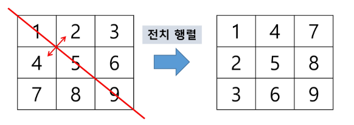
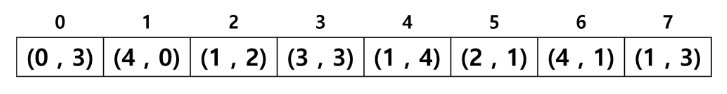

# 2023.02.16

# APS기본 - List4

## 2차원 배열

### 2차원 배열의 선언

- 2차원 이상의 다차원 배열은 차원에 따라 index를 선언
- 2차원 배열의 선언 : 세로길이(행의 개수), 가로길이(열의 개수)를 필요로 함

### 배열 순회

- n X m 배열의 n * m 개의 모든 원소를 빠짐 없이 조사하는 방법

### 행 우선 순회



```java
int i; // 행의 좌표 => r (row)
int j; // 열의 좌표 => c (column)

for i from 0 to n-1
	for j from 0 to m-1
		Array[i][j] // 필요한 연산 수행
```

### 열 우선 순회



```java
int i; // 행의 좌표 => r (row)
int j; // 열의 좌표 => c (column)

for j from 0 to m-1
	for i from 0 to n-1
		Array[i][j] // 필요한 연산 수행
```

### 지그재그 순회

- 인덱스가 홀수번인 것은 역방향



```java
int i; // 행의 좌표 => r (row)
int j; // 열의 좌표 => c (column)

for i from 0 to n-1
	for j from 0 to m-1
		Array[i][j+(m-1-2*j)*(i%2)] // 필요한 연산 수행
```

```java
// 5-1. 지그재그 순회
for (int i = 0; i < n; i++) {
			if (i % 2 == 0) {
				for (int j = 0; j < m; j++) {
					System.out.printf("%3d", arr[i][j]);
				}
			} else {
				for (int j = m - 1; j >= 0; j--) {
					System.out.printf("%3d", arr[i][j]);
				}
			}
		}
```

```java
// 5-2. 지그재그 순회
for (int i = 0; i < n; i++) {
			if (i % 2 == 0) {
				for (int j = 0; j < m; j++) {
					System.out.printf("%3d", arr[i][j]);
				}
			} else {
				for (int j = 0; j < m; j++) {
					System.out.printf("%3d", arr[i][m - 1 - j]);
				}
			}
		}
System.out.println();
```

```java
// 5-3. 지그재그 순회
		for (int i = 0; i < n; i++) {
			for (int j = 0; j < m; j++) {
				System.out.printf("%3d", arr[i][j + (m - 1 - 2 * j) * (i % 2)]);
			}
		}
		System.out.println();
```

### 델타를 이용한 2차 배열 탐색

- 2차 배열의 한 좌표에서 4방향의 인접 배열 요소를 탐색하는 방법

```java
array[0..n-1][0..n..-1] // 2차원 배열
dr[] <- {-1, 1, 0, 0}; // 상하좌우
dr[] <- {0, 0, -1, 1};

for r in from 0 to n-1
	for c in from 0 to n-1
		for d in from 0 to 3
			nr <- r +dr[d];
			nc <- r +dc[d];
			// 조건
			array[nr][nc]; // 필요한 연산 수행
```

- 배열을 벗어나지 않게 하기 위해 경계 조건 필요
    - 경계 안으로 들어올 때만 하겠다.
    - 0보단 작고 N보다는 커야하기 때문에 && 조건

```java
if (nr >= 0 && nr < N && nc >= 0 && nc < N) {
	System.out.println(arr[nr][nc]);
}
```

- 범위를 벗어나면 아래 실행문에 도달하지 않고 바로 넘어가겠다

```java
if (nr < 0 || nr >= N || nc < 0 || nc >= N)
	continue;
System.out.println(arr[nr][nc]);
```

### 전치행렬



```java
arr = {{1,2,3},{4,5,6},{7,8,9}} // 3*3 행렬
int i;
int j;

for i from 0 to 2
	for j from 0 to 2
		if(i < j)
			swap(arr[i][j], arr[j][i]);
```

- 대각선인 주축 (i == j)일때는 바꾸지 않아도 됨
    - 2,3,6은 `i < j`
    - 4,7,8은 `i > j`
- swap(`A[i][j]`, `A[j][i]`)

## 카운팅 정렬(Counting Sort)

- 항목들의 순서를 결정하기 위해 집합에 각 항목이 몇 개씩 있는지 세는 작업을 하여, 선형 시간에 정렬하는 효율적인 알고리즘

### 제한 사항

- 정수나 정수로 표현할 수 있는(양의 정수) 자료에 대해서만 적용 가능
- 각 항목의 발생 회수를 기록하기 위해, 정수 항목으로 인덱스 되는 카운트들의 배열을 사용하기 때문이다.
- 카운트들을 위한 충분한 공간을 할당하려면 집합 내의 가장 큰 정수를 알아야 한다.

### 시간 복잡도

- O(n+k) : n은 배열의 길이, k는 정수의 최대값

### 카운팅을 정렬하는 과정

- 1단계
    - Data에서 각 항목들의 발생 횟수를 세고, 정수 항목들로 직접 인덱스 되는 카운트 배열 counts에 저장한다.
- 2단계
    - 정렬된 집합에서 각 항목의 앞에 위치할 항목의 개수를 반영하기 위해 counts의 원소를 조정한다.
- DATA

| 0 | 4 | 1 | 3 | 1 | 2 | 4 | 1 |
| --- | --- | --- | --- | --- | --- | --- | --- |
- COUNTS

| 1 | 3 | 1 | 1 | 2 |
| --- | --- | --- | --- | --- |
- 누적합 COUNTS ⇒ 상대적 위치

| 1 | 4 | 5 | 6 | 8 |
| --- | --- | --- | --- | --- |

- 3단계
    - counts[1]을 감소시키고 Temp에 1을 삽입한다.
    - counts[4]를 감소시키고 Temp에 4를 삽입한다.
    - counts[2]를 감소시키고 Temp에 2를 삽입한다.
    - counts[1]을 감소시키고 Temp에 1을 삽입한다.
    - counts[3]을 감소시키고 Temp에 3을 삽입한다.
    - counts[1]을 감소시키고 Temp에 1을 삽입한다.
    - counts[4]을 감소시키고 Temp에 4을 삽입한다.
    - counts[0]을 감소시키고 Temp에 0을 삽입한다.
    
- 4단계
    - Temp 업데이트 완료하고 정렬 작업을 종료한다.
    

```java
Counting_Sort(A, B, k)
// A [] -- 입력 배열
// **B** [] -- 정렬된 배열
// C [] -- 카운트 배열
// k    -- 최대 값, n : 입력 배열의 길이

C = new int[k];

for i from 0 to n
	C[A[i]] += 1; // 개수 세기 ⭐

for i from 1 to k
	C[i] += C[i-1] // 누적 합 ⭐⭐

for i from n-1 to 0
	B[C[A[i]]-1] = A[i]
	C[A[i]] -= 1 // 누적합 배열에서 1 빼기
```

- 숫자 `i`의 상대적 위치 : 인덱스로 바꾸려면 -1 해서 사용
- 누적합의 배열에서 사용하고 나서 -1
- 누적합의 배열이 곧 인덱스다… ⭐

```java
package test02;

import java.util.Arrays;

public class Test4 {
	public static void main(String[] args) {
		int[] arr = {5, 2, 4, 1, 2, 3, 3};
		
		// 1단계
		// counting 배열
		// count[i] : i의 개수
		int[] count = new int[6]; // 인덱스 5까지 쓸 것이므로..
		
		for(int i = 0; i < arr.length; i++) {
			count[arr[i]]++;
		}
		System.out.println(Arrays.toString(count));
		
		// 2단계
		// count 배열을 => prefix 배열로 사용
		for(int i = 1; i <= 5; i++) {
			count[i] += count[i-1];
		}
		System.out.println(Arrays.toString(count));
		
		// 3단계
		// arr 배열을 다시 돌면서,
		// 새로운 배열의 새로운 좌표에 옮긴다.
		int[] arr2 = new int[arr.length];
		for(int i = 0; i < arr.length; i++) {
			// 새로운 배열에 새로운 위치에 원래의 숫자를 넣어준다
			// for문으로 돌리면 시간이 오래걸림. 인덱스로 접근하여 정렬
			arr2[count[arr[i]] - 1] = arr[i];
			// 한번 쓸 때마다 하나씩 줄이기
			count[arr[i]]--;
		}
		System.out.println(Arrays.toString(arr2));
		
		System.out.println(Arrays.toString(count));
	}
}
```

### 카운팅 정렬을 항상 사용하는게 좋은가?

- `{1, 2, 10억, 1}` 을  정렬하라고 했을 때 메모리 낭비가 발생

### 카운팅 정렬은 안정정렬이라고 하는데 무슨 뜻인가?

- 같은 값을 가지는 복수의 원소들이 정렬 후에도 정렬 전과 같은 순서를 가진다.

### 복수의 원소를 카운팅 정렬하자.



- 뒤에  숫자를 먼저 정렬
