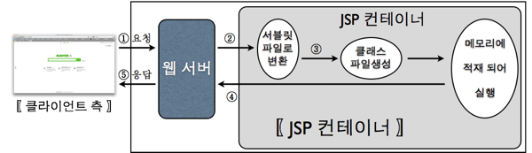

# 2023.03.08

# Web-BackEnd<JSP>

## JSP(Java Server Page)

### JSP

- Servlet 표준을 기반으로 작성된 웹 어플리케이션 개발 언어
- HTML 내에 Java를 작성하여 동적으로 웹페이지를 생성하여 브라우저에게 돌려주는 페이지
- 실행 시 Servlet으로 변환된 후 실행 ⭐

<br>

<br>

### JSP 동작



<br>

<br>

### JSP 구성요소

- 지시자 (Directive)
    - JSP 페이지에 대한 설정 정보를 저장하기 위해서 사용
- 스크립트 요소 : 스크립트릿(Scriptlet), 표현식(Expression), 선언부(Declaration)
    - JSP에서 문서의 내용을 동적으로 생성하기 위해 사용
- JSP 기본 객체
    - 요청 및 응답 관련 정보를 얻거나, 응답 결과를 만들기 위해 사용
- 표현 언어(Expression Language)
    - JSP를 좀 더 간결하게 작성하기 위해 사용
- Action Tag와 JSTL
    - 자주 사용하는 기능을 모아 미리 정의하여 Tag형태로 작성한다
    - JSP에서 자바코드를 쉽게 작성할 수 있도록 사용

<br>

<br>

<br>

## JSP 기본태그

### JSP 태그 종류

| 종류 | 사용 용도 | 형식 |
| --- | --- | --- |
| 스크립트릿(scriptlet) | 자바 코드 작성 | <%  %> |
| 선언(declaration) | 변수와 메소드를 선언 | <%! %> |
| 표현식(expression) | 계산식이나 함수를 호출한 결과를 문자열 형태로 출력 | <%= %> |
| 주석(comment) | JSP 페이지 설명 작성 | <%-- --%> |
| 지시자(directive) | JSP 페이지 속성 지정 | <%@ %> |

<br>

<br>

### 스크립트릿(Scriptlet)

- 스크립팅 언어(java)로 작성된 코드 조각을 포함하는데 사용

```java
<%
		// 자바 코드 작성
%>

<%
		int A = 10;
		int B = 20;

		int sum = A + B;
		
		out.print(A + "+" + B + "=" + sum);
%>

// 출력
10+20=30
```

<br>

<br>

### 선언부(Declaration)

- 멤버 변수 선언이나 메서드를 선언하는 영역

```java
<%!
		// 변수 선언
		// 메서드 선언
%>

<%!
		String name = "SSAFY";
		public int add(int a, int b){
			return a + b;
		}
%>
```

<br>

<br>

### 표현식(Expression)

- 변수의 값이나 계산식 혹은 함수를 호출한 결과를 문자열 형태로 웹문서에 출력

```java
<%= 변수 %>
<%= 수식 %>
<%= 메소드 호출 %>

<body>
		<%= name %>  ==> out.print(name);
</body>
```

<br>

<br>

### 주석문(Comment)

- 작성한 코드에 대한 설명을 기술할 경우 사용
- HTML 주석문과 동일한 기능을 하지만 HTML 주석문은 클라이언트에게 보여지고 JSP 주석문은 보여지지 않는다

```java
<!-- 이것은 HTML 주석입니다. -->
<%-- 이것은 JSP 주석입니다. --%>
<h1>Hello</h1>
<%="김보연" %>
```

<br>

<br>

### 지시자(Directive)

- 웹컨테이너(Tomcat)가 JSP 번역하고 실행하는 방법을 서술
- page : 해당 JSP 페이지 전반적으로 환경을 설정할 내용 지정
- include : 현재 페이지에 다른 파일의 내용 삽입할 때 사용
- taglib : 태그 라이브러리에서 태그를 사용할 수 있는 기능 제공

```java
<%@ 지시자 속성 = "값" %>
```

<br>

<br>

### 지시자(Directive) - page

- JSP 페이지 실행 매개변수를 제어
- 출력처리, 오류처리 등의 내용을 포함

```java
<%@ page language="java" contentType="text/html; charset=UTF-8"
		pageEncoding="UTF-8"%>
```

| 속성 | 설명 | 기본값 |
| --- | --- | --- |
| language | 스크립트에서 사용할 언어 지정 | java |
| contentType | JSP가 생성할 문서의 MIME 타입과 캐릭터 인코딩 | text/html |
| import | JSP에서 사용할 java 클래스를 지정 |  |
| session | JSP가 세션을 사용할지 여부 지정 | true |
| buffer | JSP 페이지의 출력 버퍼 크기 지정, ‘none’일 경우 출력 버퍼를 사용하지 않는다 | 8kb |
| errorPage | JSP 실행 중 에러 발생시 출력할 페이지 지정 |  |
| isErrorPage | 에러가 발생했을 때 보여줄 페이지인지 지정 | false |
| pageEncoding | JSP 소스코드의 인코딩 지정 | ISO-8859-1 |
| info | 현재 JSP페이지에 대한 설명 |  |
| autoflush | 버퍼의 내용을 자동으로 브라우저로 보낼지에 대한 설정 | true |
| isThreadsafe | 현재 JSP가 멀티스레드로 동작해도 안전한지 여부를 설정, ‘false’일 경우 SingleThread로 동작 | true |
| extends | JSP 페이지를 기본적인 클래스가 아닌 다른 클래스를 상속토록 변경 | javax.servlet.jsp.HttpJspPage |

<br>

<br>

### 지시자(Directive) - include

- JSP 내에 다른 HTML 문서나 JSP 페이지의 내용을 삽입할 때 사용
- 반복적으로 사용되는 부분 (header, footer 등) 별도로 작성하여 페이지 내에 삽입하면 반복되는 코드의 재작성을 줄일 수 있다.

```java
<%@ include file="/template/header.jsp" %>
```

<br>

<br>

### 지시자(Directive) - taglib

- JSTL 또는 사용자가 작성한 커스텀 태그를 사용할 때 작성
- 불필요한 자바 코드를 줄일 수 있다

```java
<%@ taglib uri="http://java.sun.com/jsp/jstl/core" prefix="C" %>
```

<br>

<br>

<br>

## JSP 기본객체

### JSP 기본 객체

- JSP에서는 서버 정보 및 요청, 응답에 대한 데이터를 조회, 조작하기 위한 객체 제공

| 내장 객체 | 타입 | 설명 |
| --- | --- | --- |
| request | javax.servlet.http.HttpServeltRequest | 요청 정보를 저장하는 객체 |
| response | javax.servlet.http.HttpServeltResponse | 응답 정보를 저장하는 객체 |
| pageContext | javax.servlet.jsp.PageContext | JSP 페이지 정보를 저장하는 객체 |
| session | javax.servlet.http.HttpSession | HTTP 세션 정보를 저장하는 객체 |
| application | javax.servlet.ServletContext | 웹 어플리케이션 context 정보를 저장하는 객체 |
| out | javax.servlet.jsp.jsp.jspWriter | 결과를 출력하기 위해서 사용하는 스트림 |
| config | javax.servlet.ServletConfig | JSP 페이지 설정 정보를 포함하는 객체 |
| page | java.lang.Object | JSP 페이지를 구현한 자바 클래스 인스턴스 |
| exception | java.lang.Throwable | 에러페이지에서 사용하는 객체, 오류정보 담음  |

<br>

<br>

### JSP 기본 객체 영역(scope)


<br>

<br>

### JSP 기본 객체 영역(scope) 메서드

- servlet과 페이지 간 정보를 공유하기 위해서 메서드를 지원한다
- 

| 메서드 | 반환형 | 설명 |
| --- | --- | --- |
| setAttribute(String name, Object value) | void | key-value 형태로 각 영역에 데이터를 저장
name이 value를 얻어 오기 위한 key가 된다 |
| getAttribute(String name) | Object | 현재 객체에서 인자로 받은 이름으로 설정된 값 반환 |
| getAttributeNames() | Enumeration | 현재 객체에서 설정된 값의 모든 속성의 이름을 반환 |
| removeAttribute(String name) | void | 현재 객체에서 인자로 받은 이름으로 설정된 값을 삭제 |

<br>

<br>

<br>

## 페이지 이동

### 페이지 이동

- 요청(request)을 받아서 화면을 변경하는 방법은 두 가지가 있다
    - 포워드 방식
        - 요청이 들어오면 요청을 받은 JSP 또는 Servlet이 직접 응답을 작성하지 않고, 요청을 서버내부에서 전달하여 해당 요청을 처리하게 하는 방식
        - request, response 객체가 전달되어 사용되기 때문에 객체가 사라지지 않는다. 브라우저에는 최초 요청한 주소가 표시된다.
        
        ```java
        RequestDispatcher dispatcher = request.getRequestDispatcher("이동할 페이지");
        dispatcher.forward(request, response);
        ```
        
    - 리다이렉트 방식
        - 요청이 들어오면 내부 로직 실행 후, 브라우저의 URL을 변경하도록 하여 새로운 요청을 생성함으로써 페이지를 이동한다.
        - 브라우저가 새로운 요청을 만들어 내기 때문에 최초 요청 주소와 다른 요청주소가 화면에 보여진다
        
        ```java
        response.sendRedirect("location");
        ```
