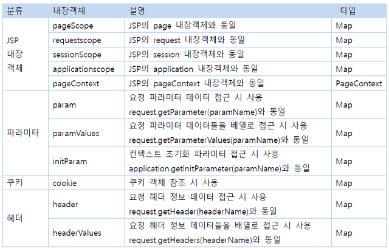

# 2023.03.10

# Web-BackEnd(EL & JSTL)

## EL(Expression Language)

### EL이란?

- 표현 언어라고 하며 값(data)를 웹 페이지에 표시하는데 사용되는 태그
- JSP 스크립트의 표현식 `<%= %>` 을 대신하여 속성값을 쉽게 출력할 수 있도록 고안된 언어

```java
스크립트 표현식 : <%= expr %>  EL : ${expr }
```

- EL 표현식에서 Map 객체 또는 Java Bean 객체의 경우 도트 `.` 연산자를 사용하여 속성을 출력할 수 있다. 이 때 오른쪽의 값은 Map 객체의 경우 key, Java Bean의 경우 Bean property 이다
- JSP 영역 기본 객체 (page, request, session, application) 속성 사용 가능
- 수치, 관계, 논리연산 제공
- 자바 클래스 메서드 호출 기능 제공
- 표현언어 기본 객체 제공(param, paramValues)

<br>

<br>

### EL 문법

```java
// 스크립트릿
<%= ((com.ssafy.model.MemberDto)
request.getAttribute("userinfo")).getZipDto().getAddress() %>

↓

// EL
${userinfo.zipDto.address}
```

- `[ ]` 연산자를 이용해서 객체의 속성에 접근 가능
    - 대상 객체가 Map 또는 Java Bean인 경우 `${ obj["key(property)"]}` 형태로 사용 가능
    - 대상 객체가 리스트 또는 배열의 경우 `${obj[index]}` 또는 `${obj["index"]}` 형태 사용가능
    
- 내장객체



<br>

<br>

### EL 연산자(Operator)


- EL 식은 연산자를 포함할 수 있으며, 산술 연산, 조건 연산, 논리 연산, 관계 연산을 수행할 수 있다.
- 또한 일반적인 연산 이외에 `null` 연산을 수행할 수 있다. `empty` 연산자는 검사할 객체가 `null` 인지 아닌지 검사하기 위해서 사용된다. (null, “”, 요소가 없는 list, map, collection은 True)

```java
${ empty name }
```

<br>

<br>

### EL로 기본 객체 속성 설정하기 / 요청 파라미터 처리하기

⭐ property 이름만 사용할 경우 pageScope > requestScope > sessionScope > applicationScope 순으로 객체 찾음

- 예시 1 ) `request.setAttribute("userInfo", "ssafy");`

```java
1. ${requestScope.userInfo)
2. ${pageContext.request.userInfo)
3. ${userInfo}
```

- 예시 2 ) `url?name=ssafy&hobby=등산&hobby=수영`

```java
1. ${param.name}
2. ${paramValues.hobby[0]}, ${paramValues.hobby[1]}
```

<br>

<br>

<br>

## JSTL(JSP Standard Tag Library)

### JSTL이란?

- JavaEE 기반의 웹 어플리케이션 개발을 위한 컴포넌트 모음
- JSP 스크립트와 html코드가 섞여서 복잡한 구조를 만든다. 이를 간결하게 작성하기 위해서 자바코드를 태그 형태로 작성해 놓은 것
- 유용한 커스텀 태그들을 모아서 표준화 한 것

### JSTL 기능

- 간단한 프로그램 로직 구현 기능 - 변수선언, if 문장, for문 등
- 데이터 출력 포맷 설정
- DB 입력, 수정, 삭제, 조회 기능
- 문자열 처리 함수
- XML 문서 처리
- 위 기능들을 가지고 있는 라이브러리 : `core` , `format` , `sql` , `functions` , `xml`

<br>

<br>

### JSTL 사용하기

[https://mvnrepository.com/artifact/javax.servlet/jstl/1.2](https://mvnrepository.com/artifact/javax.servlet/jstl/1.2)

- `taglib` 지시자를 이용한 태그 사용 선언

```java
<%@ taglib uri="http://java.sun.com/jsp/jstl/core" prefix="c" %>
```

- 사용하고자 하는 기능에 따라 어떤 라이브러리를 사용할지 작성한다 (ex. core)
- 사용할 태그를 구분하기 위해서 `prefix` 를 작성해준다

```java
<c:out value="Hello! JSTL"/>
```

- prefix에 작성한 접두사를 적어주고, 기능에 따른 태그를 선택하여 작성한다

<br>

<br>

### JSTL 사용하기

| 기능 | prefix | URI |
| --- | --- | --- |
| 기본기능, 변수선언, 로직 구현 | c | https://java.sun.com/jsp/jstl/core |
| 데이터 출력 포맷 | fmt | https://java.sun.com/jsp/jstl/fmt |
| 데이터베이스작업 | sql | https://java.sun.com/jsp/jstl/sql |
| XML 관련 기능 | x | https://java.sun.com/jsp/jstl/xml |
| 문자열 처리 함수 | fn | https://java.sun.com/jsp/jstl/fn |

<br>

<br>

### JSTL - Core

| 태그 | 설명 |
| --- | --- |
| c:set | 변수에 값 설정 |
| c:remove | 변수 제거 |
| c:if | 조건에 따른 코드 실행 |
| c:choose | when, otherwise(when의 조건에 안걸리면) tag와 함께 쓰인다. if-else 와 동일하게 사용 |
| c:forEach | 배열, collection의 각 요소에 접근하기 위해 사용 |
| c:import | 외부 자원을 사용하기 위해서 사용 |
| c:forTokens | 구분자를 이용하여 구분된 토큰을 처리 |
| c:redirect | redirect 시 사용 |
| c:url | URL 작성 |
| c:out | 출력 |
| c:catch | 예외 처리 |

<br>

<br>

### `c:set` 태그

- 기본 형식
- `<c:set var="변수 이름" value="변수 값" scope="page|request|session|application"/>`

| 속성 | 설명 |
| --- | --- |
| var | 변수 이름 지정 |
| value | 변수 값 지정 |
| scope | 변수의 유효영역 지정, 작성하지 않으면 기본값 page |
| target | 속성 값을 지정할 java bean 객체 |
- 예시 ) request 영역에 name 속성을 지정하고 ssafy라는 문자열을 저장
    - `<c:set var="name" value="ssafy" scope="request"`
    - == `request.setAttribute("name", "ssafy")` 자바코드와 동일
- java bean 객체에 속성값 지정

```java
// java bean 객체 생성 및 할당
<c:set var="user1" value="<%= new com.ssafy.model.User() %>"/>
              ↑
			java bean 객체 이름

// java bean 객체 속성값 지정
<c:set target="${user1}" property="name" value="ssafy"></c:set>
			             ↑                 ↑            ↑
             java bean 객체  java bean 속성이름 할당 할 값
```

<br>

<br>

### `c:if` 태그

- 기본 형식

```java
<c:if test="조건식">
	조건이 참일 경우 실행할 문장
</c:if>
```

- ‘menu’ 파라미터가 1이라면 한식 출력

```java
<c:if test="${param.menu == 1}">
	<c:out value="한식"/>
</c:if>
```

- 현재 사용자가 작성자라면, 삭제 링크 출력

```java
<c:if test="${writerid == userid}">
	<a href="url">삭제</a>
</c:if>
```

<br>

<br>

### `c:forEach` 태그

- 컬렉션에 있는 항목들에 대하여 반복 수행
- `begin` `end` `step` 속성을 이용하여 반복할 항목을 지정할 수 있다
- `varStatus` 속성을 이용해 요소의 순번, 개수 등을 출력할 수 있다.
- 기본 형식

```java
<c:forEach [var="변수"] items="배열,Map,Collection 등">
		동작코드
</c:forEach>
```

```java
// 영화 목록 출력
<%
String[] movies = {"아이언맨", "쇼생크탈출", "겨울왕국", "어벤져스:앤드게임", "범죄도시"};
request.setAttribute("movies", movies};
%>
<br>
<c:forEach var="movie" items="${movies}"
	begin="0" end="5" step="1" varStatus="varStatus">
count : ${varStatus.count}, index : ${varStatus.index}, ${movie }<br>
</c:forEach>

// 출력화면
count : 1, index : 0, 아이언맨
count : 2, index : 1, 쇼생크탈출
count : 3, index : 2, 겨울왕국
count : 4, index : 3, 어벤져스:앤드게임
count : 5, index : 4, 범죄도시
```
