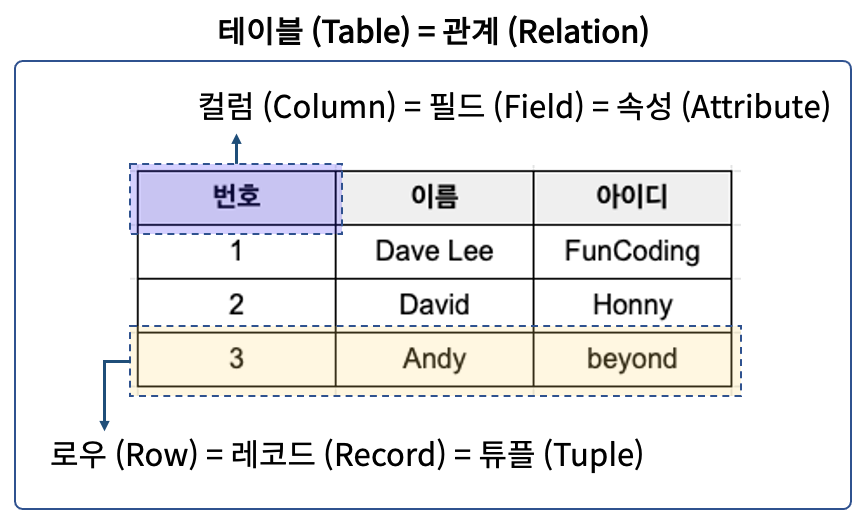

# 2023.03.14

# DB(DataBase & SQL)

## 데이터베이스(Data Base)

### 데이터베이스란?

- 여러 사람이 공유하고 사용할 목적으로 통합 관리되는 정보의 집합
- 논리적으로 연관된 하나 이상의 자료의 모음으로 그 내용을 고도로 구조화 함으로써 검색과 갱신의 효율화를 꾀한 것
- 몇 개의 자료 파일을 조직적으로 통합하여 자료 항목의 중복을 없애고 자료를 구조화하여 기억시켜놓은 자료의 집합체
- 조직 또는 개인이 필요에 의해 논리적으로 연관된 데이터를 모아 일정한 형태로 저장한 것

```
1. 통합된 데이터(Integrated Data)
    - 각자 사용하던 데이터를 모아서 중복을 최소화하고 데이터 불일치를 제거

2. 저장된 데이터(Stored Data)
    - 문서 형태로 보관되는 것이 아니라 저장장치(디스크, 테이프 등 컴퓨터 저장장치)에 저장됨

3. 운영데이터(Operational Data)
    - 조직의 목적을 위해서 사용되는 데이터를 의미

4. 공용데이터(Shared Data)
    - 여러 사람이 각각 다른 목적의 업무를 위해서 공통으로 사용되는 데이터를 의미
```

<br>

<br>

### DBMS(Database Management System)

- 데이터베이스 관리 프로그램
    - 데이터베이스 조작 인터페이스 제공
    - 효율적인 데이터 관리 기능 제공
    - 데이터베이스 구축 기능 제공
    - 데이터 복구, 사용자 권한부여, 유지보수 기능제공

<br>

<br>

### 데이터베이스의 역사

- 1960년대 - 데이터 베이스의 등장
    - 계층적 모델 : IBM-information Management System(IMS)
    - 네트워크 모델 : Charles Bachman - Integrated Data Store(IDS)
- 1970년대 - 관계형 데이터 베이스 등장
    - Edgar F. Codd에 의해 관계형 데이터 모델 소개 : IBM - System R 개발
- 1980년대 - 데이터베이스 성장 및 표준화
    - 관계형 데이터베이스 모델(Relational Database Model) 의  성장
    - ANSI(American National Standard Institute) 에서 SQL 표준 제정
- 1990년대 - 객체 지향과 다양한 관계형 모델 제품 등장
    - 객체지향 발전에 따른 데이터 처리 방식 다양화
    - Oracle, DB2, MS SQL SERVER 등 다양한 제품 등장 및 발전

<br>

<br>

<br>

## 관계형 데이터베이스(Relational DB)

### 관계형 데이터 베이스란?

- 테이블(Table) 기반의 Database
- 테이블(Table)
    - 실제 데이터가 저장되는 곳
    - 행과 열의 2차원 구조를 가진 데이터 저장 장소
- 데이터를 테이블 단위로 관리
    - 하나의 데이터(record)는 여러 속성(Attribute)를 가진다
    - 데이터 중복을 최소화
    - 테이블 간의 관계를 이용하여 필요한 데이터 검색 가능

<br>

<br>

### 관계형 데이터 베이스 테이블 구조



<br>

<br>

### 관계형 데이터 베이스 관리 시스템


<br>

<br>

<br>

## SQL(Structured Query Language)

### SQL 이란?

- 관계형 데이터 베이스에서 데이터 조작과 데이터 정의를 위해 사용하는 언어
    - 데이터 조회(R)
    - 데이터 삽입(C), 삭제(D), 수정(U)
    - DB Object 생성 및 변경, 삭제
    - DB 사용자 생성 및 삭제, 권한 제어
- 표준 SQL은 모든 DBMS에서 사용 가능

<br>

<br>

### SQL 특징

- 배우고 사용하기 쉽다
- 대소문자를 구별하지 않는다. (데이터의 대소문자는 구분)
    - SQL 키워드는 대문자 `SELECT` 사용 권장.
- 절차적인 언어가 아니라 선언적 언어이다
- DBMS에 종속적이지 않다.

```
1. DML ( Data Manipulation Language ) : 데이터 조작 언어
	- 데이터 베이스에서 데이터를 조작하거나 조회할 때 사용
	- 테이블의 레코드를 CRUD ( Create, Read, Update, Delete )

2. DDL ( Data Definition Language ) : 데이터 정의 언어
	- 데이터 베이스 객체(table, view, user, index 등)의 구조를 정의

3. DCL ( Data Control Language ) : 데이터 제어 언어
	- Database, Table 접근 권한이나 CRUD 권한 정의
	- 특정 사용자에게 테이블의 검색권한 부여, 금지

4. TCL ( Transaction Control Language ) : 트랜잭션 제어 언어
	- 트랜잭션 단위로 실행한 명령문을 적용(commit)하거나 취소(roll back)
```

<br>

<br>

### SQL 종류


<br>

<br>

<br>

## DDL (Data Definition Language)

### 데이터베이스 생성하기

```sql
CREATE DATABASE databasename;

SHOW DATABASES;
// 데이터 베이스 생성 후, 다음 명령어를 이용해서 데이터 베이스의 목록을 확인할 수 있다.
```

- `CREATE DATABASE` 명령문은 새 데이터 베이스를 생성하는데 사용된다
- 데이터 베이스는 여러 테이블을 포함하고 있다
- 데이터 베이스 생성시 관리자 권한으로 생성해야 한다

<br>

<br>

### 데이터베이스 문자 집합(Character set) 설정하기

- 데이터 베이스 생성 시 설정 또는 생성 후 수정 가능
- 문자 집합은 각 문자가 컴퓨터에 저장될 때 어떠한 ‘코드’로 저장되는지 규칙을 지정한 집합
- Collation은 특정 문자 집합에 의해 데이터베이스에 저장된 값들을 비교, 검색, 정렬 등의 작업을 수행할 때 사용하는 비교 규칙 집합이다.

```sql
CREATE DATABASE db_name
			[[DEFAULT] CHARACTER SET charset_name]
			[[DEFAULT] COLLATE collation_name]
ALTER DATABASE db_name
			[[DEFAULT] CHARACTER SET charset_name]
			[[DEFAULT] COLLATE collation_name]

DEFAULT CHARACTER SET utf8mb4 - 이모지 가능
											utf8mb3 - 다국어
```

<br>

<br>

### 데이터베이스 삭제

- 데이터베이스의 모든 테이블을 삭제하고 데이터 베이스를 삭제
- 삭제 시 `DROP DATABASE` 권한 필요
- `DROP SCHEMA` 는 `DROP DATABASE` 와 동의어
- `IF EXISTS` 는 데이터베이스가 없을 시 발생할 수 있는 에러를 방지

```sql
DROP {DATABASE | SCHEMA}[IF EXISTS] db_name
```

<br>

<br>

### 데이터베이스 사용

- 데이터베이스가 있는 경우(접근 권한이 있는 경우) `USE` 명령어를 사용

```sql
USE databasename;
```

<br>

<br>

### 숫자 자료형(Numeric Data Types)


<br>

<br>

### 문자 자료형(String Data Types)


<br>

<br>

### 날짜 자료형(Date and Time Data Types)


<br>

<br>

### 바이너리 데이터 타입, BLOB and TEXT 타입


- `BINARY[(M)]` : CHAR 유형과 유사하지만 문자열이 아닌 이진 문자열을 저장한다. M은 바이트 단위의 열 길이를 나타냄
- `VARBINARY[(M)]` : VARCHAR 유형과 유사하지만 문자열이 아닌 이진 문자열을 저장한다. M은 바이트 단위의 열 길이를 나타냄

<br>

<br>

### 테이블(Table) 생성하기

```sql
CREATE TABLE table_name (
	column1 datatype [options],
	column2 datatype,
	column3 datatype,
	....
);
```

- 자주 사용하는 Options

| 옵션 | 설명 |
| --- | --- |
| NOT NULL | 해당 열의 값은 항상 존재해야하고, Null이 될 수 없음 |
| DEFAULT | 기본 값 설정 |
| AUTO INCREMENT | 새 레코드가 추가 시 값을 자동으로 1증가시켜 저장 |
| PRIMARY KEY | 테이블에서 행을 고유하게 식별하기 위해 사용 |

<br>

⭐ 모든 테이블에는 반드시 `PRIMARY KEY` 가 존재해야 함

<br>

<br>

### 제약 조건(CONSTRAINT)

- 컬럼에 저장될 데이터의 조건을 설정
- 제약조건에 위배되는 데이터는 저장 불가
- 테이블 생성 시 컬럼에 지정하거나,  constraint로 지정 가능(ALTER를 이용하여 설정 가능)

| 제약사항 | 설명 |
| --- | --- |
| NOT NULL | 각 행은 해당열의 값을 포함해야 하며 null값은 허용되지 않음 |
| UNIQUE | 컬럼에 중복된 값을 저장할 수 없음, NULL 값은 허용 |
| PRIMARY KEY | 기본키, 컬럼에 중복된 값을 저장할 수 없고, NULL 값도 허용하지 않음
주로 레코드를 구분하기 위한 유일한 값을 지정할 때 사용 |
| FOREIGN KEY | 특정 테이블의 PK컬럼에 저장되어 있는 값만 저장. ‘참조키’ , ‘외래키’
NULL 값 허용, 어떤 컬럼에 어떤 데이터를 참조하는지 반드시 지정 |
| DEFAULT | 레코드 입력 시, 해당 열의 값이 입력되지 않으면 넣어줄 값을 지정 |
| CHECK | 값의 범위나 종류를 지정. MYSQL8 버전부터 사용가능
이전 버전의 경우, 제약조건 설정은 가능하나 적용이 안됨  |

<br>

<br>

### 테이블(Table) 스키마

- 스키마(Schema) : 테이블에 저장될 데이터의 구조와 형식
    - ex) 교육생의 정보를 저장하기 위한 테이블

```sql
-- 테이블 생성
CREATE TABLE ssafy_user (
	user_num INT NOT NULL AUTO_INCREMENT PRIMARY KEY,
	user_id VARCHAR(20) NOT NULL,
	user_name VARCHAR(20) NOT NULL,
	user_password VARCHAR(20) NOT NULL,
	user_email VARCHAR(30),
	signup_date TIMESTAMP NOT NULL DEFAULT CURRENT_TIMESTAMP
);
```

<br>

<br>

### 테이블(Table) 스키마 확인하기

- `DESCRIBE` 또는 `DESC` 명령어를 이용하여 생성된 테이블 스키마 확인

```sql
{DESCRIBE | DESC } table_name;

-- 테이블 정보 확인
DESC ssafy_user;
```


<br>

<br>

<br>

## DML(Insert, Update, Delete)

### DML(Data Manipulation Language)

- 데이터베이스에 데이터를 삽입, 조회, 수정, 삭제할 때 사용
- 

| SQL문 | 설명 |
| --- | --- |
| INSERT (C) | 테이블에 새로운 레코드를 삽입 |
| SELECT (R) | 하나 이상의 테이블에서 레코드들을 조회할 때 사용 |
| UPDATE (U) | 테이블의 행을 수정 |
| DELETE (D) | 테이블의 행을 삭제  |

<br>

<br>

### Insert문

- 생성시 작성한 모든 컬럼에 입력 값이 주어지면 컬럼이름 생략 가능
- 컬럼이름과 입력 값의 순서가 일치하도록 작성
    - (`NULL` `DEFAULT` `AUTO INCREMENT` 설정 필드 생략 가능)
- ex) ssafy_user table 에 레코드 삽입하기


<br>

<br>

### UPDATE 문

- 기존 레코드를 수정한다
- `WHERE` 절을 이용해 하나의 레코드 또는 다수의 레코드를 한 번에 수정할 수 있다

```sql
UPDATE table_name
	SET col_name=value[,col_name2=value2, ...]
[WHERE where_condition];
```

<aside>
💡 WHERE 절을 생략하면 테이블의 모든 행이 수정된다. 따라서 어떠한 레코드(들)을 수정할 지 결정하는 정확한 조건문을 작성하는 연습이 필수적이다.

</aside>

ex) ssafy_user 레코드 수정하기

1. 모든 레코드의 이름을 `annonymous`로 수정하기

```sql
UPDATE ssafy_user
SET user_name = 'anonymous';
```

1. user_num 가 3번인 학생 비밀번호 1234로 수정

```sql
UPDATE ssafy_user
SET user_password = '1234';
WHERE user_num = 3;
```

수정 결과


<br>

<br>

### DELETE 문

- 기존 레코드를 삭제한다
- `WHERE` 절을 이용해 하나의 레코드 또는 다수의 레코드를 한 번에 삭제할 수 있다.
    
    ```sql
    DELETE FROM tbl_name
    [WHERE where_condition];
    ```
    

<br>

<br>

<br>

## DML(Select)

### SELECT 문

- 테이블에서 레코드를 조회하기위해 사용
- 조회 시 컬럼이름이나 표현식을 조회할 수 있고 별칭(alias) 사용이 가능하다
- `*` 는 모든 속성을 조회한다
- `WHERE` 조건식을 이용하여 원하는 레코드를 조회할 수 있다

```sql
SELECT[DISTINCT] { *|column_name|expressions[alias]}
FROM table_references
[WHERE where_condition]
[GROUP BY{col_name|expr|position},]
[HAVING where_condition]
[ORDER BY {col_name|expr|position|[ASC|DESC]]
[LIMIT {[offset,]row_count|row_count OFFSET offset}]
```

<br>

<br>

### 기본 SELECT 문

```sql
// 모든 사원 정보 검색
SELECT * 
FROM emp;

// 사원이 근무하는 부서번호 검색
SELECT deptno
FROM emp;

SELECT DISTINCT deptno
FROM emp;

// 사원의 이름(ename), 부서번호(deptno), 업무(job)조회
SELECT ename, deptno, job
FROM emp;
```

<br>

<br>

### 기본 SELECT문 - 별명(alias), 사칙연산

- 사원의 이름, 사번, 급여 * 12(연봉), 업무 조회
- as 를 이용하여 조회 시 컬럼이름 변경 가능(띄어쓰기 포함 시 `""` 로 묶어준다

```sql
SELECT ename as 이름, empno as 사번, sal * 12 as 연봉, job as "업 무"
FROM emp;
```

- 사원의 이름, 사번, 커미션, 급여, 커미션 포함 급여 조회

```sql
SELECT ename 이름, empno as "사번", comm 커미션, sal as 급여, sal + comm as "커미션 포함 급여",
			 sal + IFNULL(comm, 0) as "커미션 포함 급여2"
FROM emp;
```

- 사칙연산 사용가능, `NULL` 값은 계산 불가
- `IFNULL` 함수를 이용하여 `NULL` 값 처리 - `IFNULL (expr1, expr2)` : exp1이 NULL 이면 exp2가 return

<br>

<br>

### 기본 SELECT - CASE Function

- 문법

```sql
CASE
	WHEN condition1 THEN result1
	WHEN condition2 THEN result2
	WHEN conditionN THEN resultN
	ELSE result
END;

// 모든 사원의 사번, 이름, 급여, 급여등급조회(5000이상 -> 고액연봉, 2000이상 -> 평균연봉 ...)
SELECT empno 사번, ename 이름, sal 급여,
	CASE WHEN sal >= 5000 THEN '고액연봉'
			 WHEN sal >= 2000 THEN '평균연봉'
			 ELSE '저액연봉'
	END "연봉등급"
FROM emp;
```

- CASE 문은 조건을 통과하고 첫 번째 조건이 충족될 때 값을 반환한다
- 조건이 충족되지 않으면 ELSE 절의 값을 반환한다

<br>

<br>

### WHERE 절

- WHERE 절은 조건에 맞는 레코드를 조회하기 위해서 사용

```sql
SELECT column1, column2, ...
FROM table_name;
WHERE condition;

// 부서 번호가 30인 사원중 급여가 1500 이상인 사원의 이름, 급여, 부서번호 조회
SELECT ename, sal, deptno
	FROM emp
WHERE deptno = 30
	AND sal >= 1500;

// 부서 번호가 20 또는 30인 부서에서 근무하는 사원의 사번, 이름, 부서번호 조회
SELECT empno, ename, deptno
	FROM emp
WHERE deptno = 30
	 OR deptno = 20;
```

<aside>
💡 WHERE 절은 SELECT 문장 뿐아니라, UPDATE, DELETE 등 다른 문장에서도 사용됨

</aside>

- `!=` `<>` 모두 not equal을 의미한다

```sql
SELECT empno, ename, deptno
	FROM emp
WHERE deptno != 30
	 OR deptno <> 20;

// NOT - 조건문이 NOT TRUE일 때 레코드를 조회
SELECT empno, ename, deptno
	FROM emp
WHERE NOT (deptno = 30
	 or deptno = 20);
```

- `IN` - 피연산자가 여러 표현 중 하나라도 같다면 TRUE
    - ex) 업무(job)가 ‘MANAGER’, ‘ANALYST’, ‘PRESIDENT’인 사원의 이름, 사번, 업무 조회
    
    ```sql
    SELECT empno, ename, job
    	FROM emp
    WHERE job in (‘MANAGER’, ‘ANALYST’, ‘PRESIDENT’);
    
    // 부서번호가 10, 20이 아닌 사원의 사번, 이름, 부서번호 조회
    SELECT empno, ename, deptno
    	FROM emp
    WHERE deptno not in (10, 20);
    ```
    

- `BETWEEN` 값이 주어진 범위의 범위 안에 있으면 조회
    - 값은 숫자나 문자 날짜가 될 수 있다
    
    ```sql
    WHERE column_name BETWEEN value1 AND value2;
    
    // 급여가 2000 이상 3000 이하인 사원의 사번, 이름, 급여 조회
    SELECT empno, ename, sal
    	FROM emp
    WHERE sal BETWEEN 2000 AND 3000;
    
    // 입사일이 1981년인 직원의 사번, 이름, 입사일 조회
    SELECT empno, ename, hiredate
    	FROM emp
    WHERE hiredate between '1981-01-01' AND '1981-12-31';
    ```
    
- NULL 비교 - `IS NULL` , `IS NOT NULL`
    - 값이  NULL인지 NULL이 아닌지 검사하기 위해서 사용
    
    ```sql
    // 커미션이 NULL인 사원의 사번, 이름, 커미션 조회
    SELECT empno, ename, comm
    	FROM emp
    WHERE comm = NULL;
    
    SELECT empno, ename, comm
    	FROM emp
    WHERE comm IS NULL;
    
    // 커미션이 NULL이 아닌 사원의 사번, 이름, 업무, 커미션 조회
    SELECT empno, ename, job, comm
    	FROM emp
    WHERE comm IS NOT NULL;
    ```
    

<br>

<br>

### SELECT - `LIKE`

- LIKE - WHERE 절에서 칼럼의 값이 특정 패턴을 가지는지 검사하기 위해서 사용
- 와일드카드 `(%,_)` 를 이용해 패턴을 표현한다.
    - `%` : 0개 이상의 문자를 의미
    - `_` : 문자 하나를 의미
- 이름이 ‘M’ 으로 시작하는 사원의 사번, 이름 조회

```sql
SELECT empno, ename
	FROM emp
WHERE ename like 'M%';
```

- 이름에 ‘E’ 가 포함된 사원의 사번, 이름 조회

```sql
SELECT empno, ename
	FROM emp
WHERE ename like '%E%';
```

- 이름의 세 번째 알파벳이 ‘A’인 사원의 사번, 이름 조회

```sql
SELECT empno, ename
	FROM emp
WHERE ename like '__A%';
```

<br>

<br>

### ORDER BY

- 조회 결과를 오름차순(ASC) 또는 내림차순(DESC)으로 정렬할 때 사용한다.(default: ASC)
- 정렬 기준(칼럼)을 지정할 수 있다

```sql
SELECT column1, column2, ...
FROM table_name
ORDER BY column1, column2, ... ASC|DESC;

// 모든 직원의 모든 정보를 이름을 기준 내림차순으로 정렬하여 조회
SELECT *
	FROM emp
ORDER BY ename DESC;

// 모든 사원의 사번, 이름, 급여를 조회. 단, 급여 순 내림차순 정렬
SELECT empno, ename, sal
	FROM emp
ORDER BY sal DESC;

// 20, 30번 부서에 근무하는 사원의 사번, 이름, 부서번호, 급여를 조회
// 단, 부서별 오름차순 정렬 후, 급여 순 내림차순 정렬
SELECT empno, ename, deptno, sal
	FROM emp
WHERE deptno in (20, 30)
ORDER BY deptno, sal DESC;
```

<br>

<br>

<br>

## MySQL Functions(내장 함수)

### 숫자 관련 함수(Numeric Functions)


```sql
// 2의 3제곱
SELECT POW(2,3);

// 8 나누기 3의 나머지
SELECT MOD(8,3);

// 최대값, 최소값
SELECT greatest(4, 3, 7, 5, 9), least(4, 3, 7, 5, 9);

// 반올림
SELECT round(1526.159), round(1526.159, 0)
```

<br>

<br>

### 문자 관련 함수(String Functions)


| 함수 | 설명 |
| --- | --- |
| STRCMP | 두 문자열 비교 |
| SUBSTR | 문자열에서 부분 문자열 추출 |
| LPAD | 특정 길이로 문자열을 다른 문자열의 왼쪽에 채움 |
| RPAD | 특정 길이로 문자열을 다른 문자열의 오른쪽에 채움 |
| REPEAT | 지정된 횟수만큼 문자열을 반복 |
| REVERSE | 문자열을 뒤집고 결과를 반환 |

```sql
// 아스키 코드 값 얻기
SELECT ASCII('0'), ASCII('A'), ASCII('a');

// PRESIDENT의 이름은 KING입니다.
SELECT CONCAT('PRESIDENT의 이름은', ename, ' 입니다.')
	FORM emp
WHERE job = 'PRESIDENT';

// 이름의 길이가 5인 직원의 이름 조회
SELECT ename
	FROM emp
	WHERE LENGTH(ename) = 5;

// '김싸피'의 길이
SELECT LENGTH('김싸피'), CHAR_LENGTH('김싸피');
```

```sql
// 문자열 변경
SELECT REPLACE('Hello abc abc !!', 'abc', 'Ssafy');

// 문자열 인덱스
SELECT INSTR('hello ssafy !!!', 'ssafy');

// 모든 직원의 이름 앞 글자 3자리 조회
SELECT SUBSTR(ename, 1, 3)
	FROM emp;

// *****SSAFY, SSAFY*****
SELECT LPAD('SSAFY', 10,'*'), RPAD('SSAFY',10,'*');

//!YFASS OLLEH
SELECT REVERSE('HELLO SSAFY!');
```

<br>

<br>

### 날짜 관련 함수(Date Functions)

| 함수 | 설명 |
| --- | --- |
| DATE | datetime 표현식에서 날짜 부분을 추출하여 날짜 반환 |
| ADDTIME | 시간/날짜/시간에 시간 간격을 추가한 다음 시간/날짜/시간을 반환 |
| DATEDIFF | 두 날짜 값 사이의 일 수를 반환 |
| DAY | 주어진 날짜의 해당 달의 날짜를 반환 |
| NOW SYSDATE CURRENT_TIMESTAMP | 현재 날짜와 시간을 반환 |
| YEAR | 주어진 날짜의 연도 부분을 반환 |
| YEARWEEK | 주어진 날짜의 연도 및 주 번호를 반환 |
| DAYNAME | 주어진 날짜의 요일 이름을 반환 |
| MONTH | 주어진 날짜의 월 부분을 반환 |

```sql
// 2초 더하기
SELECT ADDTIME('2022-02-13 17:29:21", "2");

// 727일
SELECT DATEDIFF("2008-02-18", "2006-02-21");

// 오늘은?
SELECT NOW(), DAY(NOW()), MONTH(NOW()), YEAR(NOW()), YEARWEEK(NOW());
```

<br>

<br>

### 그 외 기타 중요 함수(Advanced Functions)

| 함수 | 설명 |
| --- | --- |
| BIN | 숫자의 이진 표현을 반환 |
| BINARY | 값을 이진 문자열로 반환 |
| CAST | 값(모든 유형)을 지정된 데이터 유형으로 변환 |
| CONVERT | 값을 지정된 데이터 유형 또는 문자 집합으로 변환 |
| IF | 조건이 TRUE이면 값을 반환하고 조건이 FALSE이면 다른 값을 반환 |
| NULLIF | 두 표현식을 비교하고 같으면 NULL을 반환. 그렇지 않으면 첫 번째 표현식이 반환 |
| IFNULL | 표현식이 NULL이면 지정된 값을 반환하고, 그렇지 않으면 표현식을 반환 |
| LAST_INSERT_ID | 테이블에 삽입되거나 업데이트된 마지막 행의 AUTO_INCREMENT ID를 반환  |

<br>

<br>

### 집계 함수(Aggregate Function)

- 여러 값의 집합(복수 행)에 대해서 동작한다.(복수 행 함수, 통계함수, 그룹함수)
- `GROUP BY` 절과 함께 사용해 전체 집합의 하위 집합을 그룹화한다

| 함수 | 설명 |
| --- | --- |
| AVG | 인수의 평균 값을 반환 |
| COUNT | 조회된 행의 수를 반환 |
| MAX | 최대값 반환 |
| MIN | 최소값 반환 |
| SUM | 합 반환 |
| STD | 표준편차 반환 |

```sql
// 모든 사원에 대하여 사원수, 급여 총액, 평균급여, 최고급여, 최저급여를 조회
SELECT COUNT(*) 사원수, SUM(sal) 급여총액, AVG(sal) 평균급여, MAX(sal) 최고급여, MIN(sal) 최저급여
FROM emp;

// 모든 사원에 대하여 부서, 사원수, 급여 총액, 평균급여, 최고급여, 최저급여를 부서별로 조회
// 단, 평균 급여는 소수점 둘째자리 반올림
SELECT deptno 부서, COUNT(*) 사원수, SUM(sal) 급여총액, AVG(sal) 평균급여, MAX(sal) 최고급여, MIN(sal) 최저급여
FROM emp;
GROUP BY deptno;

// 모든 사원에 대하여 부서, 업무, 사원수, 급여총액, 평균급여, 최고급여, 최저급여를 부서별-직급별로 조회
SELECT deptno 부서, job 업무, COUNT(*) 사원수, SUM(sal) 급여총액, 
			 ROUND(AVG(sal),2) 평균급여, MAX(sal) 최고급여, MIN(sal) 최저급여
FROM emp;
GROUP BY deptno, job;

// 모든 사원에 대하여 이름, 부서, 업무, 사원수, 급여총액, 평균급여, 최고급여, 최저급여를 부서별-직급별로 조회
SELECT ename 이름, deptno 부서, job 업무, COUNT(*) 사원수, SUM(sal) 급여총액, 
			 ROUND(AVG(sal),2) 평균급여, MAX(sal) 최고급여, MIN(sal) 최저급여
FROM emp;
GROUP BY deptno, job;
```

✔️ MySQL에서는 `GROUP BY` 로 묶이지 않은 칼럼을 조회했을 때, 무의미한 데이터가 조회될 수 있으니 유의 

<br>

### 집계함수 - HAVING 절

- 집계 함수의 결과 내에서 조건문에 맞는 레코드를 조회

```sql
// 급여 (커미션 포함) 평균이 2000 이상인 부서번호, 부서별 사원수, 평균급여(커미션 포함) 조회
// 단 평균 급여는 소수점 둘째자리 반올림
SELECT deptno 부서번호, COUNT(*) 사원수, ROUND(AVG(sal+IFNULL(comm,0)),2) "평균급여(커미션포함)"
	FROM emp
GROUP BY deptno
HAVING AVG(sal+IFNULL(comm,0)) > 2000;
```

<br>
<br>

## SQL SELECT 쿼리문의 문법 순서와 실행 순서

### 문법 순서

`SELECT` -> `FROM` -> `WHERE` -> `GROUP BY` -> `HAVING` -> `ORDER BY`

<br>

### 실행 순서

`FROM` -> `ON` -> `JOIN` -> `WHERE` -> `GROUP BY` -> `HAVING` -> `SELECT` -> `DISTINCT` -> `ORDER BY`

<br>

<br>

<br>

## Transaction

### 트랜잭션

- 커밋(commit)하거나 롤백(rollback)할 수 있는 가장 작은 작업 단위
    - 커밋 : 트랜잭션을 종료하여 변경사항에 대해서 영구적으로 저장하는 SQL
    - 롤백 : 트랜잭션에 의해 수행된 모든 변경사항을 실행 취소하는 SQL

| name | description |
| --- | --- |
| START TRANSACTION | 트랜잭션을 시작함. COMMIT, ROLLBACK 이 나오기 전까지 모든 SQL을 의미 |
| COMMIT | 트랜잭션에서 변경한 사항을 영구적으로 DB에 반영 |
| ROLL BACK | START TRANSACTION 실행 전 상태로 되돌림 |

<aside>
💡 MySQL에서는 기본적으로 세션이 시작하면 autocommit 설정 상태이다. 그러므로 MySQL은 각 SQL문장이 오류를 반환하지 않으면 commit을 수행한다

</aside>


<br>
<br>

🏁 습관들이기!
1. DB_Name 있다면 삭제
2. DB_ Name 생성
3. USE DB_Name
