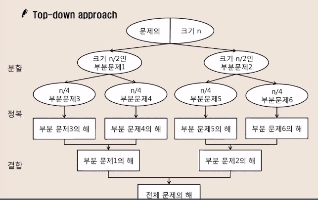

# 2023.03.22

# APS 응용 - 분할 정복

## 분할 정복

### 유래

- 1805년 12월 2일 아우스터리츠 전투에서 나폴레이옹이 사용한 전략
- 전력이 우세한 연합군을 공격하기 위해 나폴레옹은 연합군의 중앙부로 쳐들어가 연합군을 둘로 나눔
- 둘로 나뉜 연합군을 한 부분씩 격파함

<br>

<br>

### 설계 전략

- 분할(Divide) : 해결할 문제를 여러 개의 작은 부분으로 나눈다
- 정복(Conquer) : 나눈 작은 문제를 각각 해결한다
- 통합(Combine) : (필요하다면) 해결된 해답을 모은다.

<br>

<br>

### Top-down approach



<br>

<br>

### 반복(Iterative) 알고리즘 : O(n)

```java
Iterative_Power(x, n)
	result <- 1
	FOR i in 1 -> n
		result <- result * x
	RETURN result
```

<br>

<br>

### 분할 정복 기반의 알고리즘 O(log n)

```java
Recursive_Power(x, n)
	IF n == 1: RETURN x
	IF n is even
		y <- Recursive_Power(x , n / 2)
		RETURN y * y
	ELSE
		y <- Recursive_Power(x, (n - 1) / 2)
		RETURN y * y * x
```

<br>

<br>

<br>

## 이진 검색

### 자료의 가운데에 있는 항목의 키 값과 비교하여 다음 검색 위치를 결정하고 검색을 계속 진행하는 방법

- 목적 키를 찾을 때 까지 이진 검색을 순환적으로 반복 수행함으로써 검색 범위를 반으로 줄여가면서 보다 빠르게 검색을 수행함

<br>

<br>

### 이진 검색을 하기 위해서는 자료가 정렬된 상태여야 함

<br>

<br>

### 검색 과정

1. 자료의 중앙에 있는 원소를 고른다
2. 중앙 원소의 값과 찾고자 하는 목표 값을 비교한다
3. 중앙 원소의 값과 찾고자 하는 목표 값이 일치하면 탐색은 종료한다
4. 목표 값이 중앙 원소의 값보다 작으면 자료의 왼쪽 반에 대해서 새로 검색을 수행하고, 크다면 자료의 오른쪽 반에 대해서 새로 검색을 수행한다
5. 찾고자 하는 값을 찾을 때까지 1~4의 과정을 반복한다


<br>

<br>

### 알고리즘 : 반복구조

```java
binarySearch(S[], n, k)
low <- 0 
high <- n - 1

WHILE low <= high
	mid <- (low + high) / 2
	IF S[mid] == key
		RETURN mid
	ELSE IF S[mid] > key
		high <- mid - 1
	ELSE
		low <- mid + 1
RETURN -1
```

<br>

<br>

### 알고리즘 : 재귀구조

```java
binarySearch(S[], low, high, key)
	IF low > high
		RETURN -1
	ELSE
		mid <- (low + high) / 2
		IF key == S[mid]
			RETURN mid
		ELSE IF key < S[mid]
			RETURN binarySearch(S[], low, mid - 1, key)
		ELSE
			RETURN binarySearch(S[], mid + 1, high, key)
```

<br>

<br>

### java.util.Arrays.binarySearch

- 이진 탐색 API

<br>

<br>

<br>

## 병합 정렬(Merge Sort)

### 여러 개의 정렬된 자료의 집합을 병합하여 한 개의 정렬된 집합으로 만드는 방식

<br>

<br>

### 분할 정복 알고리즘 활용

- 자료를 최소 단위의 문제까지 나눈 후에 차례대로 정렬하여 최종 결과를 얻어냄
- top-down 방식
- 안정 정렬

<br>

<br>

### 시간 복잡도

- O(n log n)

<br>

<br>

### 병합 정렬 과정

- 분할 단계 : 전체 자료 집합에 대하여, 최소 크기의 부분 집합이 될 때까지 분할 작업을 계속한다
- 병합 단계 : 2개의 부분 집합을 정렬하면서 하나의 집합으로 병합
- 


<br>

<br>

### 알고리즘 : 분할 과정

```jsx
mergeSort(arr[], left, right){
	IF left < right :
		mid <- (left + right) / 2
		mergeSort(arr, left, mid)
		mergeSort(arr, mid + 1, right)
		mergeSort(arr, left, mid, right)
}
```

<br>

<br>

### 알고리즘 : 병합 과정

```jsx
merge(arr[], left, mid, right){
	L <- left, R <- mid + 1
	idx <- left
	while L <= mid && R <= right {
		if arr[L] <= arr[R]
			sortedArr[idx++] <- arr[L++]
		else
			sortedArr[idx++] <- arr[R++]
	}
	if L <= mid {
		for i in L to mid
			sortedArr[idx++] <- arr[i]
	} else {
		for j in R to right
			sortedArr[idx++] <- arr[j]
	}
	for i in left to right
		arr[i] <- sortedArr[i]
```

<br>

<br>

<br>

## 퀵 정렬

### 주어진 배열을 두 개로 분할하고, 각각을 정렬한다

- 병합 정렬과 동일?

### 다른 점  1 : 병합 정렬은 그냥 두 부분으로 나누는 반면에, 퀵 정렬을 분할할때 기준 아이템(pivot item) 중심으로, 이보다 작은 것은 왼편, 큰 것은 오른편에 위치

<br>

<br>

### 다른 점 2 : 각 부분 정렬이 끝난 후, 병합 정렬은 “병합” 이라는 후 처리 작업이 필요하지만 퀵 정렬은 필요하지 않음

<br>

<br>

### 불안정 절려

<br>

<br>

### 시간복잡도 O(n log n), 최악의 경우는 n제곱

<br>

<br>

### 동작 과정

1. 정렬한 배열 입력
2. 임의의 한 점을 pivot으로 선정(Partition 방법)
    1. pivot 보다 작은 값들은 왼쪽으로, 큰 값들은 오른쪽으로 이동
    2. 정렬할 범위가 0이나 1이될때까지 분할 정복

<br>

<br>

### 알고리즘

```jsx
quickSort(A[], l, r)
	if l < r
		pivot <- partition(a, l, r)
		quickSort(A[], l, pivot - 1)
		quickSort(A[], pivot + 1, r)
```

<br>

<br>

### Hoare-Partition 알고리즘

```jsx
Hoare-Partition(arr[], left, right){
	pivot <- arr[left] // 제일 왼쪽 값 pivot
	L <- left + 1, R <- right
	while(L <= R) {
		while(L <= R and arr[L] <= pivot) L++
		while(arr[R] > pivot) R--
		if(L < R)
			swap(arr[L], arr[R])
	}
	swap(arr[left], arr[R])
	return R
}
```

<br>

<br>


<br>

<br>

### Lomuto partition 알고리즘

```jsx
Lomuto-Partition(arr[], left, right){
	pivot <- arr[right]
	i <- left - 1
	
	FOR j in left -> right - 1
		IF arr[j] <= pivot
			i++
			swap(arr[i], arr[j])
	swap(arr[i + 1], arr[right])
	RETURN i + 1
}
```
