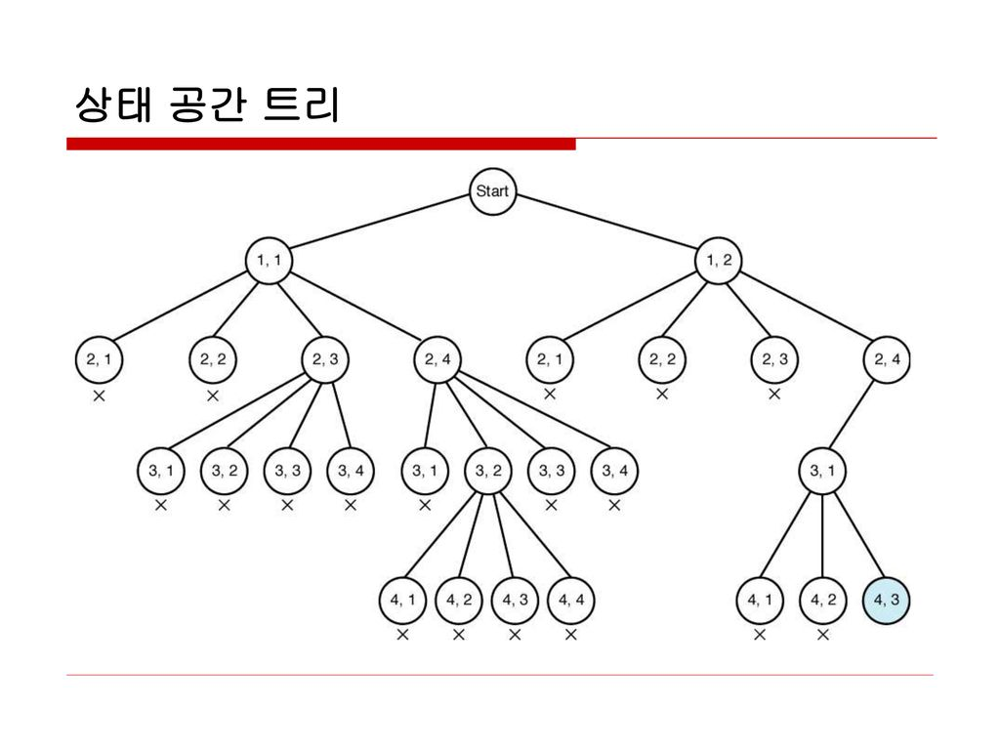

# 2023.03.23

# APS - 백트래킹

## 백트래킹

### 여러가지 선택지(옵션)들이 존재하는 상황에서 한 가지를 선택한다

<br>

<br>

### 선택이 이루어지면 새로운 선택지들의 집합이 생성된다

<br>

<br>

### 이런 선택을 반복하면서 최종 상태에 도달한다

- 올바른 선택을 계속하면 목표 상태(goal state)에 도달한다

<br>

<br>

### 당첨 리프 노드 찾기

- 루트에서 갈 수 있는 노드를 선택한다
- 꽝 노드까지 도달하면 최근의 선택으로 되돌아와서 다시 시작한다
- 더 이상의 선택지가 없다면 이전의 선택지로 돌아가서 다른 선택을 한다
- 루트까지 돌아갔을 경우 더 이상 선택지가 없다면 찾는 답이 없다

<br>

<br>

### 백트래킹과 깊이 우선 탐색과의 차이

- 어떤 노드에서 출발하는 경로가 해결책으로 이어질 것 같지 않으면 더 이상 그 경로를 따라가지 않음으로써 시도의 횟수를 줄임(Prunning 가지치기)
- 깊이 우선 탐색이 모든 경로를 추적하는데 비해 백트래킹은 불필요한 경로를 조기에 차단
- 깊이 우선 탐색을 가하기에는 경우의 수가 너무나 많음. 즉 NI가지의 경우의 수를 가진 문제에 대해 깊이 우선 탐색을 가하면 당연히 처리 불가능
- 백트래킹 알고리즘을 적용하면 일반적으로 경우의 수가 줄어들지만 이 역시 최악의 경우에는 여전히 지수함수 시간(Exponential Time)을 요하므로 처리 불가능

<br>

<br>

### 루트 노드에서 리프 노드까지의 경로는 해답 후보 (candidate solution)가 되는데, 깊이 우선 검색을 하여 그 해답 후보 중에서 해답을 찾을 수 있다

<br>

<br>

### 그러나 이 방법을 사용하면 해답이 될 가능성이 전혀 없는 노드의 후손 노드(descendant)들도 모두 검색해야 하므로 비효율적이다

<br>

<br>

### 모든 후보를 검사? 아니다

<br>

<br>

### 백트래킹 기법

- 어떤 노드의 유망성을 점검한 후에 유망(promising)하지 않다고 결정되면 그 노드의 부모로 되돌아가(backtracking) 다음 자식 노드로 감
- 어떤 노드를 방문하였는데 그 노드를 포함한 경로가 해답이 될 수 없으면 그 노드는 유망하지 않다고 하며, 반대로 해답의 가능성이 있으면 유망하다고 한다
- 가지치기(prunning) : 유망하지 않는 노드가 포함되는 경로는 더 이상 고려하지 않는다

<br>

<br>

### 백트래킹을 이용한 알고리즘의 절차

1. 상태 공간 트리의 깊이 우선 검색을 실시한다
2. 각 노드가 유망한지 점검
3. 만일 그 노드가 유망하지 않으면 그 노드의 부모 노드로 돌아가서 검색을 계속한다

<br>

<br>

### 일반 백트래킹 알고리즘

```java
checknode(node v)
	IF promising(v)
		IF there is a solution at v
			write the solution
		ELSE
			FOR each child u of v
				checknode(u)
```

<br>

<br>

### 상태 공간 트리



<br>

<br>

### 깊이 우선 탐색 vs 백트래킹

- 순수한 깊이 우선 검색 = 155 노드
- 백트래킹 = 27노드

```java
bool backtrack(선택 집합, 선택한 수, 모든 선택 수)
{
	if(선택한 수 == 모든 선택 수) // 더 이상 탐색할 노드가 없다
	{
		찾는 솔루션인지 체크
		return 결과;
	}
	
	현재 선택한 상태 집합에 포함되지 않는 후보 선택들(노드) 생성

	모든 후보 선택들에 대해
	{
		선택 집합에 하나의 후보 선택을 추가
		선택한 수 = 선택한 수 + 1
		결과 = backtrack 호출(선택 집합, 선택한 수, 모든 선택수)
		
		if(결과 == 성공)
			return 성공; // 성공한 경우 상위로 전달
	}
	return 실패;
}
```

<br>

<br>

## 순열(Permutation)

```
라면을 끓이기 위해서 다음과 같은 재료가 필요하다

< 물, 스프, 면 >

위의 재료들을 넣는 순서에 따라 라면의 맛이 바뀌게 되는데
최고의 맛을 찾기 위해서는 어떻게 해야 할지 생각해보자
```

### 서로 다른 것들 중 몇 개를 뽑아서 한 줄로 나열하는 것

<br>

<br>

### 서로 다른 n개 중 r개를 택하는 순열은 아래와 같이 표현


<br>

<br>

### 다수의 알고리즘 문제들은 순서화된 요소들의 집합에서 최선의 방법을 찾는 것과 관련이 있다

- 예 : TSP(Traveling Salesperson Problem, 외판원 순회)

<br>

<br>

### N 개의 요소들에 대해서 n! 개의  순열들이 존재한다

- 12! = 479,001,600
- n > 12인 경우, 시간 복잡도 폭발적으로 증가

<br>

<br>

### 단순하게 순열을 생성하는 방법

- 예 ) {1, 2, 3} 을 포함하는 모든 순열을 생성하는 함수
    - 동일한 숫자가 포함되지 않았을 때, 각 자리 수 별로 loop를 이용해 아래와 같이 구현 가능

```java
FOR i1 in 1 -> 3
	FOR i2 in 1 -> 3
		IF i2 != i1
			FOR i3 in 1 -> 3
				IF i3 != i1 AND i3 != i2
					print(i1, i2, i3)
```

<br>

<br>

### 사전적 순서(Lexicographic-Order)

- {1, 2, 3}, n = 3 인 경우 다음과 같이 생성
- [1 2 3] [1 3 2] [2 1 3] [2 3 1] [3 1 2] [3 2 1]

<br>

<br>

### 최소 변경을 통한 방법(Minimum-exchange requirement)

- 각각의 순열들은 이전의 상태에서 단지 두 개의 요소들 교환을 통해 생성
- [1 2 3] [3 2 1] [2 3 1] [2 1 3] [3 1 2] [1 3 2]

<br>

<br>

### 최소한의 변경(Minimum-change requirement)를 통해 다음 순열을 생성하는 방법

- 1950년대의 교회의 종소리 패턴하고 유사
- Johnson-Trotter 알고리즘

<br>

<br>

### swap을 통한 순열 생성

```java
arr[] : 데이터가 저장된 배열

swap(i, j) : arr[i] <-- 교환 --> arr[j]

n : 원소의 개수, k : 현재까지 교환된 원소의 개수

perm(n, k)
	IF k == n
		print array // 원하는 작업 수행
	ELSE
		FOR i in k -> n - 1
			swap(k, i);
			perm(n, k + 1);
			swap(k, i);
```

<br>
<br>

### 방문체크를 통한 순열 생성

```java
nums : 데이터
result : 결과 저장 배열
check : 해당 원소 사용했는지 체크하기 위한 배열

permutation(idx){
	if idx == N
		(순열 생성 완료)
		return
	for i from 0 to N-1
		if check[i] {continue}
		result[idx] = nums[i]
		check[i] = true
		permutation(idx + 1)
		check[i] = false
}
```

<br>

<br>

### 비트마스킹을 통한 순열 생성

```java
nums : 데이터
sel : 결과 저장 배열
visited : 해당 원소 사용했는지 체크

permutation(idx, visited){
	if idx == N
		(순열 생성완료)
		return
	for i from 0 to N-1
		if visitied & (1 << i) != 0 {continue}
		sel[idx] = nums[i]
		permutation(idx+1, visited | 1 << i)
}
```
