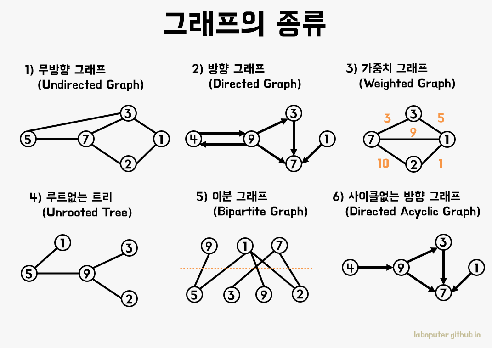

# 2023.03.27

# APS - 그래프(Graph)

## 그래프 기본

### 그래프

- 아이템(사물 또는 추상적 개념)들과 이들 사이의 연결 관계 표현
- 정점(Vertex)들의 집합과 이들을 연결하는 간선(Edge)들의 집합으로 구성된 자료구조
- 선형자료구조나 트리자료구조로 표현하기 어려운 M:N관계를 표현



<br>

<br>

### 완전 그래프

- 정점들에 대해 가능한 모든 간선들을 가진 그래프

<br>

<br>

### 부분 그래프

- 원래 그래프에서 일부의 정점이나 간선을 제외한 그래프

<br>

<br>

### 인접(Adjacency)


- 두 개의 정점에 간선이 존재(연결됨)하면 서로 인접해 있다고 한다
- 완전 그래프에 속한 임의의 두 정점들은 모두 인접해 있다.

<br>

<br>

### 경로(path)란 간선들을 순서대로 나열한 것

<br>

<br>

### 경로 중 한 정점을 최대한 한 번만 지나는 경로를 단순경로라 한다.

<br>

<br>

### 시작한 정점에서 끝나는 경로를 사이클(Cycle)이라고 한다

<br>

<br>

<br>

## 그래프 표현 방법

### 간선의 정보를 저장하는 방식, 메모리나 성능을 고려해서 결정

### 인접 행렬(Adjacent matrix)

- V x V 크기의 2차원 배열을 이용해서 간선 정보를 저장
- 배열의 배열(Reference Array)

<br>

<br>

### 인접 리스트(Adjacent List)

- 각 정점마다 해당 정점으로 나가는 간선의 정보를 저장

<br>

<br>

### 간선의 배열(Edge Array)

- 간선(시작 정점, 끝 정점)을 배열에 연속적으로 저장

<br>

<br>

### 두 정점을 연결하는 간선의 有無를 행렬로 표현

- V x V 정방 행렬
- 행 번호와 열 번호는 그래프의 정점에 대응
- 두 정점이 인접되어 있으면 1, 그렇지 않으면 0으로 표현
- 무향 그래프
    - i번째 행의 합 = i번째 열의 합 = V의 차수
- 유향 그래프
    - 행 i의 합 = V의 진출 차수
    - 열 i의 합 = V의 진입 차수
    

<br>

<br>

### 각 정점에 대한 인접 정점들을 순차적으로 표현

<br>

<br>

### 하나의 정점에 대한 인접 정점들을 각각 노드로 하는 연결 리스트로 저장


```java
// 무방향 그래프
노드 수 = 간선의 수 * 2
각 정점의 노드 수 = 정점의 차수

// 방향 그래프
노드 수 = 간선의 수
각 정점의 노드 수 = 정점의 진출 차수
```

<br>

<br>

### 정점과 정점의 연결 정보인 간선을 배열에 저장

<br>

<br>

### 간선을 표현하는 두 정점의 정보를 배열 혹은 객체로 저장할 수 있음
