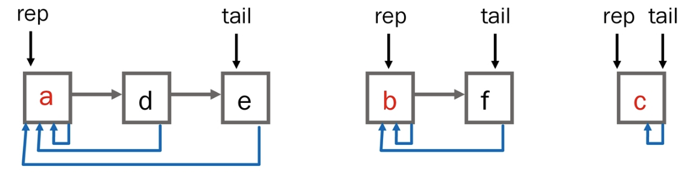

# 2023.03.29

# APS - 그래프 심화(Graph)

## 서로소 집합(Disjoint sets)

- 서로소 또는 상호배타 집합들은 서로 중복 포함된 원소가 없는 집합들이다
    - 다시 말해 교집합이 없다
- 집합에 속한 하나의 특정 멤버를 통해 각 집합들을 구분한다
    - 이를 대표자 representative라 한다
- 상호배타 집합을 표현하는 방법
    - 연결 리스트
    - 트리
- 상호배타 집합 연산
    - `Make-Set(x)`
    - `Find-Set(x)`
    - `Union(x, y)`
    

<br>

<br>

### 상호 배타 집합 표현 - 연결리스트

- 같은 집합의 원소들은 하나의 연결리스트로 관리한다
- 연결리스트의 맨 앞의 원소를 집합의 대표 원소로 삼는다
- 각 원소는 집합의 대표원소를 가리키는 링크를 갖는다



- 연결리스트 연산 예
    - Find-Set(e) return a
    - Find-Set(f) return b
    - Union(a, b)


<br>

<br>

### 상호 배타 집합 표현 - 트리

- 하나의 집합(a disjoint set)을 하나의 트리로 표현한다
- 자식 노드가 부모 노드를 가리키며 루트 노드가 대표자가 된다


<br>

<br>

### 상호 배타 집합에 대한 연산

- `Make-Set(x)` : 유일한 멤버 x를 포함하는 새로운 집합을 생성하는 연산

```java
Make-Set(x)
	p[x] <- x
```

- `Find-Set(x)` : x를 포함하는 집합을 찾는 연산

```java
Find-Set(x)
	IF x == p[x] : RETURN x
```

- `Union(x, y)` : x와 y를 포함하는 두 집합을 통합하는 연산

```java
Union(x, y)
	p[Find-Set(y)] <- Find-Set(x)
```

<br>

<br>

### 문제점


- Find-Set했을 때 중복된 호출이 여러번 일어난다
- 편향 트리가 되면 시간이 오래걸린다

<br>

<br>

### 연산의 효율을 높이는 방법


- Rank를 이용한 Union
    - 각 노드는 자신을 루트로 하는 subtree의 높이를 랭크(rank)라는 이름으로 저장한다
    - 두 집합을 합칠 때 rank가 낮은 집합을 rank가 높은 집합에 붙인다
    - rank가 같다면 어느 곳에 붙여도 상관이 없다. 하지만 붙이고 나서 붙인 쪽의 값을 증가시켜주어야 함. ⭐


- Path compression
    - Find-Set을 행하는 과정에서 만나는 모든 노드들이 직접 root를 가리키도록 포인터를 바꾸어준다
    

<br>

<br>

### `Make-Set() 연산`

- `Make-Set(x)` : 유일한 멤버 x를 포함하는 새로운 집합을 생성하는 연산

```java
p[x] : 노드 x의 부모 저장
rank[x] : 루트 노드가 x인 트리의 랭크 값 저장

Make-Set(x)
	p[x] <- x
	rank[x] <- 0  // 문제 풀 때는 없어도 되긴 하지만 이론적으로 접근했을 때에는 초기화해주기
```

<br>

<br>

### `Find-Set` 연산

- `Find-Set(x)` : x를 포함하는 집합을 찾아내는 오퍼레이션
- Find-Set 연산은 특정 노드에서 루트까지의 경로를 찾아가며서 노드의 부모 정보를 갱신한다

```java
Find-Set(x)
	IF x != p[x] : x가 루트가 아닌 경우
		p[x] <- Find-Set(p[x])
	RETURN p[x]
```

<br>

<br>

### `Union` 연산

- `Union(x, y)` : x와 y를 포함하는 두 집합을 통합하는 오퍼레이션

```java
Union(x, y)
	Link(Find_Set(x), Find_Set(y))
```

```java
Link(x, y) // 대표자들 넘어옴
	IF rank[x] > rank[y] : // rank는 트리의 높이
		p[y] <- x
	ESLE
		p[x] <- y
		IF rank[x] == rank[y] :
			rank[y]++
```

<br>

<br>

## 최소 비용 신장 트리(Minimum Spanning Tree, MST)

### 신장트리

- 그래프의 모든 정점과 간선의 부분 집합으로 구성되는 트리

<br>

<br>

### 최소신장트리

- 신장 트리 중에서 사용된 간선들의 가중치 합이 최소인 트리

<br>

<br>

### 특징

- 무방향 가중치 그래프
- 그래프의 가중치의 합이 최소여야 한다
- N개의 정점을 가지는 그래프에 대해 반드시(N-1)개의 간선을 사용해야 한다
- 사이클을 포함해서는 안된다

<br>

<br>

### 사용하는 이유?

- 도로망, 통신망, 유통망 등등 여러 분야에서 비용을 최소로 해야 그만큼의 이익을 볼 수 있다

<br>

<br>

### 대표적인 방법

- Kruskal
- Prim

<br>

<br>

## KRUSKAL Algorithm

### 간선을 하나씩 선택해서 MST를 찾는 알고리즘

1. 최초, 모든 간선을 가중치에 따라 오름차순 정렬
2. 가중치가 가장 낮은 간선부터 선택하면서 트리를 증가시킴
    1. 사이클이 존재하면 다음으로 가중치가 낮은 간선 선택
3. n-1개의 간선이 선택될 때까지 2.을 반복
4. 그리디 알고리즘 중 하나

<br>

<br>

### 알고리즘 적용 예


```java
MST-KRUSKAL(G, w)
	A <- 0                                           // 0 : 공집합
	FOR vertex v in G.V                              // G.V : 그래프의 정점 집합
		Make_Set(v)                                    // G.E : 그래프의 간선 집합
	
	G.E에 포함된 간선들을 가중치 w에 의해 정렬

FOR 가중치가 가장 낮은 간선(u, v) ∈ G.E 선택(n-1개)
	IF Find_Set(u) != Find_Set(v)
		A <- A ∪ {(u, v)}
		Union(u, v);

RETURN A
```
