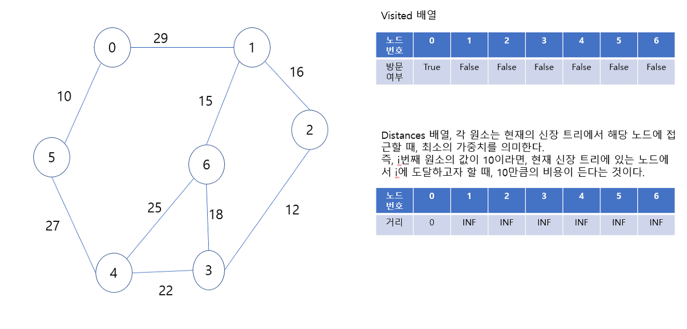

# 2023.03.30

# APS - 그래프 심화(Graph)

## 프림 알고리즘(Prim Algorithm)

### 하나의 정점에서 연결된 간선들 중에서 하나씩 선택하면서 MST만들어 가는 방식

- 임의 정점을 하나 선택해서 시작
- 선택한 정점과 인접하는 정점들 중의 최소 비용의 간선이 존재하는 정점을 선택
- 모든 정점이 선택될 때까지 1, 2번 반복

<br>
<br>

### 서로소인 2개의 집합(2 disjoint-sets) 정보를 유지

- 트리 정점들(tree vertices) - MST를 만들기 위해 선택된 정점들
- 비트리 정점들(nontree vertices) - 선택되지 않은 정점들

<br>

<br>

### 알고리즘

```java
MST_PRIM(G, r)           // G : 그래프, r : 시작 정점
	FOR u in G.V 
		u.key <- ∞     // u.key : u에 연결된 간선 중 최소 가중치
		u.π <- NULL    // u.π : 트리에서 u의 부모
	r.key <- 0
	Q <- G.V         // 우선순위 Q에 모든 정점을 넣는다
	WHILE Q != 0     // 빈 Q가 아닐동안 반복
		u <- Extract_MIN(Q) // key 값이 가장 작은 정점 가져오기
		FOR v in G.Adj[u]   // u의 인접 정점들
			IF v ∈ Q AND w(u, v) < v.key  // Q에 있는 v의 key값 갱신
				v.π <- u
				v.key <- w(u, v)
```

<br>

<br>



<br>

<br>


<br>

<br>


<br>

<br>


<br>

<br>


<br>

<br>


<br>

<br>


<br>

<br>


<br>

<br>


<br>

<br>

<br>

## 다익스트라 알고리즘(Dijkstar Algorithm)

### 최단 경로 정의

- 간선의 가중치가 있는 그래프에서 두 정점 사이의 경로들 중에 간선의 가중치의 합이 최소인 경로

<br>

<br>

### 하나의 시작 정점에서 끝 정점까지 최단경로

- 다익스트라 알고리즘 : 음의 가중치 허용 X
- 벨만-포드(Bellman-Ford) 알고리즘 : 음의 가중치 허용 O

<br>

<br>

### 모든 정점들에 대한 최단 경로

- 플로이드-워샬(Floyd-Warshall) 알고리즘

<br>

<br>

### 시작 정점에서 거리가 최소인 정점을 선택해 나가면서 최단 경로를 구하는 방식

<br>

<br>

### 탐욕 기법을 사용한 알고리즘으로 MST의 프림 알고리즘과 유사

<br>

<br>

### 시작 정점(s)에서 끝 정점(t)까지의 최단 경로에 정점 x가 존재한다

<br>

<br>

### 이 때, 최단 경로는 s에서 x 까지의 최단 경로와 x에서 t까지의 최단 경로 구성된다

<br>

<br>

### 동작 과정

1. 시작 정점을 입력 받는다
2. 거리를 저장할 D배열을  ∞로 초기화한 후 시작점에서 갈 수 있는 곳의 값은 바꿔놓는다
3. 아직 방문하지 않은 점들이 가지고 있는 거리 값과 현재 정점에서 방문하지 않은 정점까지의 가중치의 합이 작다면 변경하여 적는다.
4. 모든 정점을 방문할 때까지 반복

 

<br>

<br>

### 알고리즘

```java
G : 그래프, r : 시작 정점, S : 선택된 정점 집합
D : 출발점에서 각 정점까지 최단 경로 가중치 합을 저장
P : 최단 경로 트리 저장, ADJ(u) 정점 u의 인접 정점 집합

Dijkstra(G, r)
	S <- 
	FOR ALL v ∈ V
		D[v] <- ∞
		P[v] <- NULL
	D[r] <- 0

	WHILE S != V
		D[u]가 최소인 정점 u ∈ V - S를 선택
		S <- S u {u}
		FOR ALL v ∈ ADJ(u)
			IF v ∈ V - S AND D[v] > D[u] + weight(u, v)
				D[v] = D[u] + weight(u, v)
				P[v] = u
```

<br>

<br>


<br>

<br>


<br>

<br>


<br>

<br>


<br>

<br>


<br>

<br>


<br>

<br>


