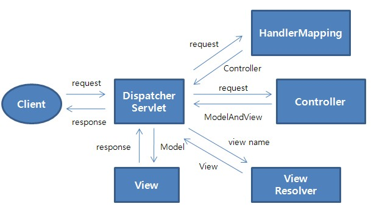

# 2023.04.13

# Spring Framework

## Spring MVC

### Spring MVC란?

- Servlet API를 기반으로 구축된 웹프레임워크
- 정식 명칭은 Spring Web MVC이지만, Spring MVC로 주로 알려져 있다.
- Spring Framework이 제공하는 DI, AOP 뿐 아니라, WEB 개발을 위한 기능을 제공
- DispatcherServelt(FrontController)를 중심으로 디자인되었으며, View Resolver, Handler, Mapping, Controller와 같은 객체와 함께 요청을 처리하도록 구성되어 있다.

<br>

<br>

### Spring Web MVC

- 다른 프레임워크와 마찬가지로 front controller pattern으로 구성됨
- 중심이 되는 DispatcherServlet(front controller)은 요청처리를 위한 기능을 제공

<br>
<br>

### Spring MVC 구성요소

- DispatcherServlet : 클라이언트 요청처리(요청 및 처리 결과 전달)
- HandlerMapping : 요청을 어떤 Controller가 처리할 지 결정
- Controller : 요청에 따라 수행할 메서드를 선언하고 요청처리를 위한 로직 수행
- ModelAndView : 요청처리를 하기 위해서 필요한 혹은 그 결과를 저장하기 위한 객체
- ViewResolver : Controller에 선언된 view이름을 기반으로 결과를 반환할 View를 결정
- View : 응답화면 생성

<br>
<br>

### Spring MVC - 요청 처리 흐름



1. 클라이언트 요청이 들어오면 DispatcherServlet이 받는다
2. HandlerMapping이 어떤 Controller가 요청을 처리할지 결정한다
3. DispatcherServlet은 Controller에 요청을 전달
4. Controller은 요청을 처리한다
5. 결과(요청처리를 위한 data, 결과를 보여줄 view의 이름)을 ModelAndView에 담아 반환
6. ViewResolver에 의해서 실제 결과를 처리할 View를 결정하고 반환
7. 결과를 처리할 View에 ModelAndView를 전달
8. DispatcherServlet은 View가 만들어낸 결과를 응답

<br>

<br>

### Spring Web MVC 구성하기 - 1

- DispatcherServlet 생성
- web.xml (pjt/src/main/webapp/WEB-INF/web.xml)

```xml
<!-- Processes application requests -->
<servlet>
	<servlet-name>appServlet</servlet-name>
	<servlet-class>org.springframework.web.servlet.DispatcherServlet</servlet-class>
	<init-param>
		<param-name>contextConfigLocation</param-name>
		<param-value>/WEB-INF/spring/appServlet/servlet-context.xml</param-value>
	</init-param>
	<load-on-startup>1</load-on-startup>
</sevlet>
```

<br>
<br>

### Spring Web MVC 구성하기 - 2

- root WebApplicationContext
    - 여러 Servlet에서 공유해야 하는 DAO, Service 등의 bean을 포함한다

```xml
<!-- The definition of the Root Spring Container shared by all Servlets and Filters -->
<context-param>
	<param-name>contextConfigLocation</param-name>
	<param-value>/WEB-INF/spring/root-context.xml</param-value>
</context-param>

<!-- Creates the Spring Container shared by all Servlets and Filters -->
<listener>
	<listener-class>org.springframework.web.context.ContextLoaderListener</listener-class>
</listener>
```

<br>
<br>

### Spring Web MVC 구성하기 - 3

- servlet-context.xml(/WEB-INF/spring/appServlet/servlet-context.xml)
- MVC 구성요소 bean 등록(handler mapping, view resovler, controller)

```xml
<!-- Resolves vies selected for rendering by @Controllers to .jsp resources in the 
<beans:bean class="org.springframework.web.servlet.view.InternalResourceViewResolver">
	<beans:property name="prefix" value="/WEB-INF/views/" />
	<beans:property name="suffix" value=".jsp" />

<context:component-scan base-package="com.ssafy.pjt02" />
```

- DefaultAnnotationHandlerMapping을 기본으로 사용하므로 별도 등록없이 사용 가능

<br>

<br>

### Spring Web MVC 구성하기 - 4

- Controller class (main/java/com/ssafy/pjt02/HomeController.java)

```java
@Controller
public class HomeController {
	private static final Logger logger = LoggerFactory.getLogger(HomeController.class);
	@RequestMapping(value="/", method= RequestMethod.GET)
	public String home(Locale locale, Model model){
		logger.info("Welcome home! The client locale is {}.", locale);

		model.addAttribute("message", "Hello! Spring!!");
		return "home";
	}
}
```

<br>
<br>

### Spring Web MVC 구성하기 - 5

- View (WEB-INF/views/home.jsp)

```java
<%@ taglib uri="http://java.sun.com/jsp/jstl/core" prefix="c" %>
<%@ page session="false" %>
<html>
<head>
	<title>home</title>
</head>
<body>
	<h2>환영합니다. 처음으로 오셨네요</h2>
	
	${msg }
	
</body>
</html>
```

<br>

<br>

### Spring Web MVC - Controller

- @RequestMapping
- URL을 클래스 또는 특정 핸들러(메서드)에 매핑
- 일반적으로 클래스에 작성하는 @RequestMapping은 요청 경로, 혹은 요청 패턴에 매칭
- 메서드 Annotation은 요청 방식(GET, POST) 등으로 범위를 좁혀 준다.

```java
@Controller
@RequestMapping("/hello")
public class HomeController{
	@RequestMapping(value="/hello", method = RequestMethod.GET)
	public String handler1(){
		return "hello1";
	}
	@RequestMapping(value = "/hello", method = RequestMethod.POST)
	public String handler2(){
		return "hello2";
	}
}
```

- Controller Handler Method argument - 1

| 파라미터 타입 | 설명 |
| --- | --- |
| HttpServletRequest
HttpServletResponse
HttpSession | Servlet API를 사용할 수 있다 |
| Locale | 요청 클라이언트의 Locale 정보를 포함 |
| InputStream
Reader
OutputStream
Writer | 요청으로부터 직접 데이터를 읽어오거나, 응답을 직접 생성하기 위해서 사용 |
| Map
Model
ModelMap | View 데이터를 전달하기 위해서 사용 |
| RedirectAttributes | 리디렉션(쿼리 문자열에 추가)시 사용할 속성 지정 |
| Errors
BindingResult | 에러와 데이터 바인딩 결과에 접근하기 위해서 사용 |
- Controller Handler Method argument - 2

| 파라미터 타입 | 설명 |
| --- | --- |
| @PathVariable | URI 템플릿 변수에 대한 액세스 |
| @RequestParam | multipart 파일을 포함하여 요청 파라미터에 액세스 |
| @RequestHeader | 요청 헤더에 액세스 |
| @CookieValue | 쿠키에 대한 액세스 |
| @RequestAttribute
@SessoinAttribute | 모든 세션 속성에 대한 액세스
요청 속성에 액세스 |
| @ModelAttribute | 모델의 속성에 액세스 |
- Controller Handler return value

| 파라미터 타입 | 설명 |
| --- | --- |
| @ResponseBody | HttpMessageConverter 구현을 통해 변환되어 응답한다 |
| HttpHeaders | 헤더가 있고 body가 없는 response를 반환 |
| String | 뷰 이름 반환(ViewResolver 선언과 함께 사용) |
| View | 렌더링 하는데 사용할 View 인스턴스 |
| Map Model | 명시적으로 모델을 작성하지 않은 경우 사용 |
| ModelAndView | 사용할 view와 속성을 포함하는 객체 |
| void | method에 ServletResponse, HttpServletResponse 인자가 있는 경우, 모든 요청이 처리된 것으로 간주, 그렇지 않으면 요청 URI를 view name으로 처리 |

<br>
<br>

### Spring Web MVC - Board

| 요청 | 설명 |
| --- | --- |
| /board | 게시판 index 페이지를 요청 |
| /board/write | GET: 게시글 작성 화면 요청
POST : 게시글 작성요청 |
| board/{bid} | 게시글 조회 |
| board/update | GET : 게시글 수정 화면 요청
POST : 게시글 수정 요청 |
| board/{bid}/delete | 게시글 삭제요청  |
1. web.xml 설정하기
2. app-context.xml
    1. Handler-mapping, ViewResolver, Controller
3. root-context.xml
    1. DAO, Service scan
4. BoardController.xml
5. BoardServicelmp.java, BoardDaoImp.java
