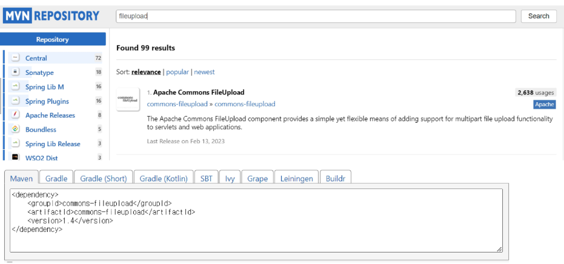

# 2023.04.18

# Spring Framework - File Upload & Download

## File Upload

### MVN Repository : File Upload 검색



<br>
<br>

### `pom.xml`

```xml
<!-- Test -->
<dependency>
	<groupId>junit</groupId>
	<artifactId>junit</artifactId>
	<version>4.7</version>
	<scope>test</scope>
</dependency>
		
✔️ Apache Commons FileUpload 의존성 추가
<!--  파일 업로드 / 다운로드 -->
<dependency>
	<groupId>commons-fileupload</groupId>
	<artifactId>commons-fileupload</artifactId>
	<version>1.4</version>
</dependency>
```

<br>
<br>

### `servlet-context.xml`

- 여기에는 web과 관련된 설정들

```xml
<context:component-scan base-package="com.ssafy.mvc" />

✔️ multipartResolver를 bean으로 등록
<beans:bean class="org.springframework.web.multipart.commons.CommonsMultipartResolver" id="multipartResolver"></beans:bean>
	<!-- 파일 업로드 용량 (10MB) -->
	<beans:property name="maxUploadSize" value="10485760" />
	<beans:property name="defaultEncoding" value="UTF-8" />
</beans:bean>
```

<br>
<br>

### CommonsMultipartResolver 속성

- `defaultEncoding(String)` : 요청에서 사용할 기본 문자 인코딩 방식을 설정한다. (기본값 : ISO-8859-1)
- `maxUploadSize(long)` : 업로드 가능 최대 크기(바이트)를 설정합니다. (-1은 무제한)
- `maxInMemorySize(int)` : 디스크에 쓰기 전에 메모리에 허용되는 최대 크기(바이트)를 설정합니다.
- `maxUploadSizePerFile(long)` : 파일 당 최대 크기를 설정합니다.

<br>

<br>

### 파일 업로드 Form

```java
<%@ page language="java" contentType="text/html; charset=UTF-8"
	pageEncoding="UTF-8"%>
<!DOCTYPE html>
<html>
<head>
<meta charset="UTF-8">
<title>파일 업로드</title>
</head>
<body>
	<h2>파일 업로드하기</h2>
	<form action="upload" method="post" enctype="multipart/form-data">
		<input type="file" name="upload-file" multiple="multiple">
		<input type="submit">
	</form>
</body>
</html>
```

<br>
<br>

### 파일 업로드 Controller

```java
@PostMapping("upload")
	public String upload(MultipartFile upload_file, Model model) {

		String uploadPath = sevletContext.getRealPath("/upload");
		String fileName = upload_file.getOriginalFilename();

		File target = new File(uploadPath, fileName);

		// 만약 file 이라고 하는 경로가 없다면 ... 만들어주는게 먼저
		if(!new Fuile(uploadPath).exists())
			new File(uploadPath).mkdir(); // 폴더 없으면 만들어

		try {
			FileCopyUtils.copy(upload_file.getBytes(), target);
		} catch (IOException e) {
			e.printStackTrace();
		}
		
		model.addAttribute("fileName", fileName);
		
		return "result";
	}
```

<br>
<br>

## File Download

### `servlet-context.xml`

```java
<!-- fileDownload -->
✔️FileDownLoadView를 bean으로 등록
<beans:bean id="fileDownLoadView" class="com.ssafy.mvc.FileDownLoadView" />

✔️ Bean이름으로 뷰를 찾기 위해 BeanNameViewResolver 등록
<beans:bean id="fileViewResolver" class="org.springframework.web.servlet.view.BeanNameViewResolver">
<beans:propery name="order" value="0" />
</beans:bean>
```

<br>

<br>

### `[FileDownLoadView.java](http://FileDownLoadView.java)` - 1

```java
✔️ AbstractView 상속하여 뷰를 만듦
public class FileDownLoadView extends AbstractView{
	public FileDownLoadView(){
		setContentType("application/download; charset=UTF-8");
	}

@Override
	protected void renderMergedOutputModel(Map<String, Object> model, HttpServletRequest request, HttpServletResponse response) throws Exception {
		ServletContext ctx = getServletContext();
		String realPath = ctx.getRealPath("/upload");
		
		✔️ MainController에서 downloadFile이라는 이름으로 넘겨준 fileInfo를 얻어옴
		Map<String, Object> fileInfo = (Map<String, Object>) model.get("downloadFile"); // 전송받은 모델(파일 정보)
        String fileName = (String) fileInfo.get("fileName");    // 파일 경로
        
        System.out.println(fileName);
        File file = new File(realPath, fileName);
		
        
        response.setContentType(getContentType());
        response.setContentLength((int) file.length());
        
        String header = request.getHeader("User-Agent");

				✔️ 윈도우 익스플로러 관련 로직
        boolean isIE = header.indexOf("MSIE") > -1 || header.indexOf("Trident") > -1;
        String filename = null;
        // IE는 다르게 처리
        if (isIE) {
        	filename = URLEncoder.encode(fileName, "UTF-8").replaceAll("\\+", "%20");
        } else {
            filename = new String(fileName.getBytes("UTF-8"), "ISO-8859-1");
        }
```

<br>
<br>

### `[FileDownLoadView.java](http://FileDownLoadView.java)` - 2

```java
				response.setHeader("Content-Disposition", "attachment; filename=\"" + filename + "\";");
        response.setHeader("Content-Transfer-Encoding", "binary");
        OutputStream out = response.getOutputStream();
        FileInputStream fis = null;
        try {
            fis = new FileInputStream(file);
            FileCopyUtils.copy(fis, out);
        } catch (Exception e) {
            e.printStackTrace();
        } finally {
            if(fis != null) {
                try { 
                    fis.close(); 
                }catch (IOException e) {
                    e.printStackTrace();
                }
            }
        }
        out.flush();
```

<br>
<br>

### `result.jsp`

```java
<!-- servlet-context.xml -->
<resources mapping="/resources/**" location="/resources/" />
<resources mapping="/file/**" location="/file/" />

<%@ page language="java" contentType="text/html; charset=UTF-8"
    pageEncoding="UTF-8"%>
<!DOCTYPE html>
<html>
<head>
<meta charset="UTF-8">
<title>결과창</title>
</head>
<body>

	✔️ resources 매핑을 이용하는 경우(servlet-context.xml)
	<a href="/mvc/file/${fileName }">다운로드</a>

	✔️ MainController를 이용하는 경우
	<a href="download?fileName=${fileName }">${fileName }다운로드</a>

</body>
</html>
```

<br>
<br>

### `Controller.java`

```java
@GetMapping(value = "/download")
public ModelAndView downloadFile(String filename){
	Map<String, Object> fileInfo = new HashMap<String, Object>();
	fileInfo.put("fileName", fileName);

	✔️ bean 이름으로 View를 찾아 downloadFile이라는 이름으로 fileInfo를 넘겨줌
	return new ModelAndView("fileDownLoadView", "downloadFile", fileInfo);
}
```
