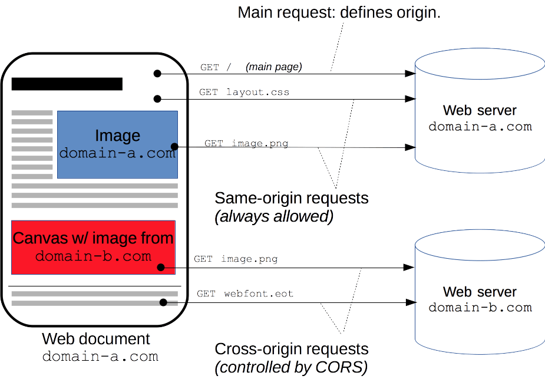

# 2023.04.26

# Spring Framework - Swagger & CORS

## Swagger

### Swagger을 이용한 REST API 문서화

- 프로젝트 개발 시 일반적으로 FrontEnd 개발자와 BackEnd 개발자가 분리
- FrontEnd 개발자의 경우 화면에 집중하고 BackEnd 개발자가 만든 문서 API를 보며 데이터 처리를 하게 된다.
- 이때 개발 상황의 변화에 따른 API의 추가 또는 변경할 때 마다 문서에 적용하는 불편함 발생
- 이 문제를 해결하기 위해 Swagger를 사용

<br>

<br>

### Swagger란?

- 기존 문서로 사용하던 문제를 해결하기 위해 Swagger 사용
- 간단한 설정으로 프로젝트의 API 목록을 웹에서 확인 및 테스트 할 수 있게 해주는 Library.
- Swagger를 사용하면 Controller에 정의되어있는 모든 URL을 바로 확인할 수 있다.
- API 목록 뿐 아니라 API의 명세 및 설명도 볼 수 있으며, 또한 API를 직접 테스트해 볼 수도 있다.

<br>

<br>

### Swagger 적용

- `pom.xl` 에 swagger2 dependency 추가

```xml
<dependency>
	<groupId>io.springfox</groupId>
	<artifactId>springfox-swagger-ui</artifactId>
	<version>3.0.0</version>
</dependency>
<dependency>
	<groupId>io.springfox</groupId>
	<artifactId>springfox-swagger2</artifactId>
	<version>3.0.0</version>
</dependency>
```

- API 페이지 호출 http://localhost:8080/context-path/swagger-ui/indext.html

<br>

<br>

### Swagger 설정

```java
@Configuration
public class SwaggerConfig {
	
	@Bean
	public Docket api(){
		return new Docket(DocumentationType.SWAGGER_2).select()
			.apis(RequestHandlerSelectors.basePackage("com.ssafy.board.controller"))
			.paths(PathSelectors.ant("/board/api/**"))
			.build().apiInfo(apiInfo());
	}
	
	private ApiInfo apiInfo(){
		return new ApiInfoBuilder()
			.title("SpringBootSwagger Test")
			.description("SSAFY Swagger")
			.version("1.0")
			.build();
	}
}
```

<br>
<br>

### Swagger 관련 Annotation

| Annotation | Description |
| --- | --- |
| @Api | Controller가 REST 방식을 처리하기 위한 것임을 명시 |
| @Apilgnore | Class, method에 선언이 가능하며 클라이언트에 노출하고 싶지 않은 경우 사용 |
| ApiOperation | 제공되는 API에 대한 간단한 설명 |
| @ApiModel | URL 경로에 있는 값을 파라미터로 추출 |
| @ApiModelProperty | 결과로 응답되는 데이터 필드에 대한 설명 |
| @ApilmplicitParam | API 요청시 설정하는 파라미터에 대한 설명 |
| @ApilmplicitParams | API 요청시 설정하는 파라미터가 여러개일 경우 ApilmplicitParam 과 함께 사용 |

<br>
<br>
<br>

## CORS(Corss-Origin Resource Sharing, 교차 출처 리소스 공유)

### CORS

- 추가 HTTP 헤더를 사용하여 한 출처에서 실행중인 웹 애플리케이션이 다른 출처의 선택한 자원에 접근할 수 있는 권한을 부여하도록 브라우저에서 알려주는 체제이다.
- 웹 애플리케이션은 리소스가 자신의 출처(도메인, 프로토콜, 포트)와 다를 때 교차 출처 HTTP 요청을 실행한다.
- 교차 출처 요청의 예시: `https://domain-a.com`의 프론트 엔드 JavaScript 코드가 `[XMLHttpRequest](https://developer.mozilla.org/ko/docs/Web/API/XMLHttpRequest)`를 사용하여 `https://domain-b.com/data.json`을 요청하는 경우
- 보안 상의 이유로, 브라우저는 스크립트에서 시작한 교차 출처 HTTP 요청을 제한한다. 예를 들어, `XMLHttpRequest`와 [Fetch API](https://developer.mozilla.org/ko/docs/Web/API/Fetch_API)는 [동일 출처 정책](https://developer.mozilla.org/ko/docs/Web/Security/Same-origin_policy)을 따른다. 즉, 이 API를 사용하는 웹 애플리케이션은 자신의 출처와 동일한 리소스만 불러올 수 있으며, 다른 출처의 리소스를 불러오려면 그 출처에서 올바른 CORS 헤더를 포함한 응답을 반환해야 한다.



<br>
<br>

### CORS 해결하기

- 프록시 서버 활용
- 헤더 추가
- `@CrossOrigin` 활용

```java
// 컨트롤러 별 설정
@CrossOrigin("*")
@RestController
@RequestMapping("/api")
public class BoardController{

// 전역 설정
@Override
public void addCorsMappings(CorsRegistry registry){
	registry.addMapping("/**")
	.allowedOrigins("*")
	.allowedMethods("GET", "POST", "PUT", "DELETE", "PATCH", "HEAD")
}
```
