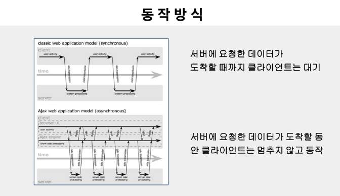

# 2023.05.10

# Vue.js - Axios

## Vue Style Guide

### Vue 코드에 대한 공식 스타일 가이드

- 필수 (Essential)
- 적극 권장 (Strongly Recommended)
- 권장 (Recommended)
- 주의 필요 (Use with Caution)

<br>
<br>

### 제시하는 스타일 가이드가 무조건적으로 적합한 것은 아니지만 권장함

- HTML과 JS에 대한 제안은 하지 않는다.
- 세미콜론, 쉼표(trailing commas) 등
- 속성 값을 위해 `' '` `/` `" "` 등

<br>
<br>

### Priority A : Essential (필수)

- 이 규칙은 오류를 예방하는데 도움을 주기 때문에 반드시 학습하고 준수하는 것이 좋음
- 예외상황이 존재하겠지만 매우 드물며 JS와 Vue에 대한 전문지식이 있어야 해결할 수 있음

<br>

<br>

### 컴포넌트 이름에 합성어 사용

- root 컴포넌트인 App과 `<transition>` , `<component>` 등 Vue에서 제공되는 빌트인 컴포넌트를 제외하고 컴포넌트의 이름은 항상 합성어를 사용해야 한다.
- 모든 HTML 요소의 이름은 한 단어이기 때문에 합성어를 사용하는 것은 기존 그리고 향후 HTML 요소와의 충돌을 방지해준다

```jsx
// Bad
Vue.component('todo', {
	// ...
})

export default {
	name: 'Todo', 
	// ...
}

// Good
Vue.component('todo-item', {
	// ...
})

export default {
	name: 'TodoItem', 
	// ...
}
```

<br>
<br>

### 컴포넌트 데이터

- 컴포넌트의 data는 반드시 함수여야 한다
- 컴포넌트 (new Vue를 제외한 모든 곳)의 data 프로퍼티의 값은 반드시 객체(object)를 반환하는 함수여야한다

```jsx
// Bad
Vue.component('some-comp', {
	data: {
		foo: 'bar'
	}
})

export default {
	data: {
		foo: 'bar'
	}
}

// Good
Vue.component('some-comp', {
	data: function() {
		return {
			foo: 'bar'
		}
	}
})

export default {
	data() {
		return {
			foo: 'bar'
		}
	}
}

// It's OK to use an object directly in a root
// Vue instance, since only a single instance
// will ever exist.
new Vue({
	data: {
		foo: 'bar'
	}
})
```

<br>
<br>

### Props 정의

- Prop은 가능한 상세하게 정의되어야 한다
- 적어도 타입은 명시되도록 가능한 상세하게 정의

```jsx
// Bad
// This is only OK when prototyping
props: ['status']

// Good
props: {
	status: String
}

// Even better!
props: {
	status: {
		type: String,
		required: true,
		validator: function (value) {
			return [
				'syncing'.
				'synced',
				'version-conflict',
				'error',
			].indexOf(value) !== -1
		}
	}
}
```

<br>
<br>

### `v-for` 에 key 지정

- 서브트리에 내부 컴포넌트 상태를 유지하기 위해 `v-for` 는 항상 key와 함께 요구된다

```jsx
// Bad
<ul>
	<li v-for="todo in todos">
		{{ todo.text }}
	</li>
</ul>

// Good
<ul>
	<li v-for="todo in todos" :key="todo.id">
		{{ todo.text }}
	</li>
</ul>
```

<br>
<br>

### `v-if` 와 `v-for` 를 동시에 사용하지 말 것

- 리스트 목록을 필터링 하기 위해서 사용(`v-for=”user in users” v-if=”user.isActive”` ) 이 경우 users를 새로운 computed 속성으로 필터링 된 목록으로 대체할 것
- 숨기기 위해 리스트의 렌더링을 피할 때 사용(`v-for=”user in users” v-if=”shouldShowUsers”` )이 경우 `v-if` 를 컨테이너 엘리먼트로 옮기기

```html
// Bad
<ul>
	<li v-for="user in users" v-if="user.isActive" :key="user.id">
		{{ user.name }}
	</li>
<ul>

<ul>
	<li v-for="user in users" v-if="shouldShowUsers" :key="user.id">
		{{ user.name }}
	</li>
<ul>

// Good
<ul>
	<li v-for="user in activeUsers" :key="user.id">
		{{ user.name }}
	</li>
<ul>

<ul v-if="shouldShowUsers">
	<li v-for="user in users" :key="user.id">
		{{ user.name }}
	</li>
<ul>
```

<br>
<br>

### 컴포넌트 스타일 스코프

```html
// Bad
<template>
	<button class="btn btn-close">X</button>
</template>

<style>
	.btn-close {
		background-color: red;
	}
</style>

// Good
<template>
	<button class="btn btn-close">X</button>
</template>

<style scoped>
	.button {
		border: none;
		border-radius: 2px;
	}
	.btn-close {
		background-color: red;
	}
</style>

```

<br>
<br>

### Private 속성 이름

- 플러그인, mixin 등에서 커스텀 사용자 private 프로퍼티에는 항상 접두사 `$_` 를 사용하라
- 다른 사람의 코드와 충돌을 피하려면 named scope를 포함하라

```jsx
// Bad
var myGreatMixin = {
    // ...
    methods: {
        update: function() {
            // ...
        }
    }
}

var myGreatMixin = {
    // ...
    methods: {
        _update: function() {
            // ...
        }
    }
}

var myGreatMixin = {
    // ...
    methods: {
        $update: function() {
            // ...
        }
    }
}

var myGreatMixin = {
    // ...
    methods: {
        $_update: function() {
            // ...
        }
    }
}

// Good
var myGreatMixin = {
    // ...
    methods: {
        $_myGreatMixin_update: function() {
            // ...
        }
    }
}

// Even better!
var myGreatMixin = {
    // ...
    methods: {
        publicMethod() {
            // ...
            myPrivateFunction()
        }
    }
}
```

<br>

<br>

### Priority B : Strongly Recommended (매우 추천)

- 이 규칙은 대부분의 프로젝트에서 가독성 그리고 개발자 경험을 향상시키는 것으로 발견
- 해당 규칙을 위반해도 코드는 실행되지만, 위반은 드물어야 하는게 좋음

<br>
<br>

### 컴포넌트 파일

```jsx
// Bad
Vue.component('TodoList', {
        // ...
})

Vue.component('TodoItem', {
        // ...
})

// Good
components/
|- TodoList.js
|- TodoItem.js

components/
|- TodoList.vue
|- TodoItem.vue
```

<br>
<br>

### 싱글 파일 컴포넌트 이름 규칙 지정

```jsx
// Bad
components/
|- mycomponent.vue

components/
|- myComponent.vue

// Good
components/
|- MyComponent.vue

components/
|- my-component.vue
```

<br>
<br>

### 기본 컴포넌트 이름

```jsx
// Bad
components/
|- MyButton.vue
|- VueTable.vue
|- Icon.vue

// Good
components/
|- BaseButton.vue
|- BaseTable.vue
|- BaseIcon.vue

components/
|- AppButton.vue
|- AppTable.vue
|- AppIcon.vue

components/
|- VButton.vue
|- VTable.vue
|- VIcon.vue
```

<br>
<br>

### 단일 인스턴스 컴포넌트 이름

- 활성 인스턴스가 하나만 있어야 하는 구성 요소는 `The` 접두사로 시작

```jsx
// Bad
components/
|- Heading.vue
|- MySidebar.vue

// Good
components/
|- TheHeading.vue
|- TheSidebar.vue
```

<br>
<br>

### 강한 연관성을 가진 컴포넌트 이름

```jsx
// Bad
components/
|- TodoList.vue
|- TodoItem.vue
|- TodoButton.vue

components/
|- SearchSidebar.vue
|- NavigationForSearchSidebar.vue

// Good
components/
|- TodoList.vue
|- TodoListItem.vue
|- TodoListItemButton.vue

components/
|- SearchSidebar.vue
|- SearchSidebarNavigation.vue
```

- Order of words in component names
- Self-closing components
- Component name casing in templates
- Component name casing in JS / JSX
- Full-word Component names
- Prop name casing
- Multi-attribute elements
- Simple expressions in templates
- Simple computed properties
- Quoted attribute values
- Directive shorthands

<br>
<br>

### Priority C : Recommended (추천)

- 동일하게 좋은 여러가지 옵션이 존재하는 경우, 일관성을 보장하기 위해 임의의 선택 가능
- 이 규칙은 각각의 수용가능한 옵션을 설명하고 기본 선택을 제안함
- 좋은 이유가 있다면 자유롭게 선택이 가능

<br>
<br>

### Component / instance options order

<br>
<br>

### Element attribute order

<br>
<br>

### Empty lines in component / instance options

<br>
<br>

### Single-file component top-level element order

<br>
<br>

### Priority D : Use with Caution (주의 요함)

- 이 규칙은 잠재적 위험 요소를 인식시켜주고 언제 그리고 왜 피해야하는지 설명해줌

<br>
<br>

### `v-if` `v-else-if` `v-else` without key

<br>
<br>

### Element selectors with scoped

<br>
<br>

### Implicit parent-child communication

<br>
<br>

### Non-flux state management

<br>
<br>

<br>

## AJAX

### 집안일 목록

- 치킨 주문하기
    - 치킨 먹기
- 세탁기에 빨래 넣고 돌리기
    - 빨래 건조기 넣고 돌리기
- 로봇 청소기 돌리기
    - 로봇 청소기 비우기
- 걸레질 하기
- 쓰레기 버리고 오기

<br>
<br>

### [참고] JavaScript는 Single thread

- 이벤트를 처리하는 Call Stack이 하나
- 즉시 처리하지 못하는 이벤트들을 (Web API)로 보내서 처리
- 처리된 이벤트들은 처리된 순서대로 (Task queue)에 저장
- Call Stack이 공백이 되면 (Event Loop)가 대기 줄에서 가장 오래된 이벤트를 Call Stack으로 보냄

```jsx
// 동기
function doStep1(init) {
    return init + 1;
}

function doStep2(init) {
    return init + 2;
}

function doStep3(init) {
    return init + 3;
}

function doOperation() {
    let result = 0;
    result = doStep1(result);
    result = doStep2(result);
    result = doStep3(result);
    console.log(`result: ${result}`);
}

doOperation();

// 비동기
function doStep1(init, callback) {
    const result = init + 1;
    callback(result);
}

function doStep2(init, callback) {
    const result = init + 2;
    callback(result);
}

function doStep3(init, callback) {
    const result = init + 3;
    callback(result);
}

function doOperation() {
    doStep1(0, result1 => {
        doStep2(result1, result2 => {
            doStep3(result2, result3 => {
                console.log(`result: ${result3}`);
            })
        })
    })
}

doOperation();
```

<br>
<br>

### AJAX(Asynchronous JavaScript and XML)

- 비동기식 JavaScript와 XML
- 서버와 통신을 하기 위해서 `XMLHttpRequest` 객체를 사용
- JSON, XML, HTML 그리고 일반 텍스트 형식 등을 포함한 다양한 포맷을 주고 받을 수 있음
- 페이지 전체를 ‘새로고침’ 하지 않고서도 수행되는 “비동기성” (일 부분만 업데이트 가능)



<br>
<br>

### XMLHttpRequest 객체

- JavaScript Object
- 서버와 상호작용하기 위해 사용
- 전체 페이지의 새로고침 없이도 URL로부터 데이터를 받아올 수 있음
- 사용자의 작업을 방해하지 않고 페이지의 일부를 업데이트 할 수 있음
- AJAX 프로그래밍에 주로 사용
- XML이라는 이름과는 달리 모든 종류의 데이터를 받아오는데 사용 가능
- http 이외의 프로토콜도 지원 (file, ftp 포함)
- 대부분의 브라우저에서 지원

<br>

<br>

### 순차적인 비동기 처리하기

- Web API로 들어오는 순서는 중요하지 않고, 어떤 이벤트가 먼저 처리되느냐가 중요(실행 순서 불명확)
1. Async Callbacks
    1. 백그라운드에서 실행을 시작할 함수를 호출할 때 인자로 지정
    2. ex : `addEventListner()` 의 두번째 인자
2. Promise-Style
    1. Modern Web APIs에서의 새로운 코드 스타일
    2. XMLHttpRequest 객체를 사용하는 구조보다 조금 더 현대적인 버전

<br>
<br>

### Promise Object

- 비동기 작업을 마치 동기 작업처럼 값을 반환해서 사용 형태
- 미래의 완료 또는 실패와 그 결과 값을 나타냄
- 미래의 어떤 상황에 대한 약속
- new Promise(function (resolve, reject) {})
- `resolve` (성공 시 사용)
- `reject` (실패 시 사용)

```jsx
const promise = new Promise((resolve, reject) => {
        resolve('resolve'); -> then 부분을 실행
        // reject('reject'); -> catch 부분을 실행
});

promise
    .then((data) => {
        console.log(data);
})
    .catch((data) => {
        console.log(data);
});
```

<br>
<br>

### Promise Methods

- `.then(callback)`
    - Promise 객체를 리턴하고 두 개의 콜백 함수를 인수로 받는다. (이행했을 때, 거부했을 때)
    - 콜백 함수는 이전 작업의 성공 결과를 인자로 전달 받음
- `.catch(callback)`
    - `.then` 이 하나라도 실패하면(거부 되면) 동작 (예외 처리 구문 유사)
    - 이전 작업의 실패로 인해 생성된 error 객체는 catch 블록 안에서 사용 가능
- `.finally(callback`
    - Promise 객체 반환
    - 결과 상관없이 무조건 실행
- 체이닝 가능

<br>
<br>

### async & await

- Promise 더욱 편하게 사용할 수 있는 문법
- then 체이닝을 제거하고 비동기 코드를 동기 코드처럼 표현하는 방법

<br>
<br>

### `async`

- `function` 앞에 위치
- 항상 Promise 반환

<br>
<br>

### `await`

- await 키워드를 만나면 Promise가 처리될 때까지 기다린다.

```jsx
async function f() {
        let promise = new Promise((resolve, reject) => {
                setTimeout(() => resolve("완료!"), 1000)
        });
    
        let result = await promise;
        alert(result);
}

f();
```

<br>
<br>

<br>

## Axios

### axios

- 브라우저와 node.js에서 사용할 수 있는 Promise 기반 HTTP 클라이언트 라이브러리
- Vue에서 권고하는 HTTP 통신 라이브러리
- 특징
    - 브라우저를 위해 XMLHttpRequests 생성
    - node.js를 위해 http 요청 생성
    - Promise API를 지원
    - 요청 및 응답 인터셉트
    - 요청 및 응답 데이터 변환
    - 요청 취소
    - JSON 데이터 자동 변환
    - XSRF를 막기 위한 클라이언트 사이드 지원

<br>
<br>

### axios 설치

- CDN : `<script src="http://unpkg.com/axios/dist/axios.min.js"></script>`
- NPM 방식 : `npm install axios`

<br>
<br>

### axios API

- `axios(config)`
- `axios(url, [, config])`
- `axios.get(url, [, config])`
- `axios.delete(url, [, config])`
- `axios.post(url [, data[, config]])`
- `axios.put(url [, data[, config]])`
