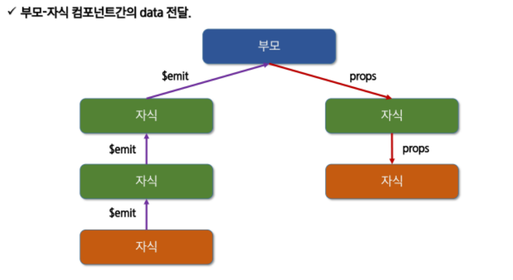

# 2023.05.11

# Vue.js - Vuex

## Vuex

### Vuex란?

- Vue.js 애플리케이션에 대한 상태관리패턴 + 라이브러리
- 애플리케이션 모든 컴포넌트들의 중앙 저장소 역할(데이터 관리)
- 부모 자식 단계가 많이 복잡해진다면 데이터의 전달하는 부분이 매우 복잡해짐
- 애플리케이션이 여러 구성 요소로 구성되고 더 커지는 경우 데이터를 공유하는 문제 발생
- devtools 확장 프로그램과 통합되어 고급 기능 제공



<br>
<br>

### 비 부모-자식간 통신

- 두 컴포넌트가 통신할 필요가 있지만 서로 부모, 자식이 아닐 수도 있음
- 비어있는 Vue Instance 객체를 Event Bus로 사용

```jsx
var bus = new Vue()

// 컴포넌트 A
bus.$emit('id-selected', 1)

// 컴포넌트 B
bus.$on('id-selected', function (id) { ... })
```

- 복잡해질 경우 상태 관리 라이브러리 Vuex 사용 권장


<br>
<br>

### 상태 관리 패턴

- 상태는 앱을 작동하는 원본 소스입니다
- 뷰는 상태의 선언적 매핑입니다
- 액션은 뷰에서 사용자 입력에 대해 반응적으로 상태를 바꾸는 방법입니다

```jsx
new Vue({
	data () { // 상태
		return {
			count: 0
		}
	},
	template: // 뷰
		`<div>{{ count }}</div>`,
	method: { // 액션
		increment() {
			this.count++
		}
	}
})
```

- 단방향 데이터 흐름


<br>
<br>

<br>

## Vuex 핵심 컨셉


<br>
<br>

### Vuex 저장소 개념

- `state` : 단일 상태 트리 사용, 애플리케이션마다 하나의 저장소를 관리 (data)
- `Getters` : Vue Instance의 computed와 같은 역할, State를 기반으로 계산 (computed)
- `Mutations` : State의 상태를 변경하는 유일한 방법 (methods)
- `Actions` : 상태를 변이 시키는 대신 액션으로 변이(Mutations)에 대한 커밋 처리 (비동기 methods)

<br>
<br>

### State

- Vuex는 단일 상태 트리 사용
- 이 단일 객체는 모든 애플리케이션 수준의 상태를 포함하며 “원본 소스”의 역할
- 각 애플리케이션 마다 하나의 저장소만 갖게 된다는 것을 의미
- 애플리케이션에서 공유해야할 data 관리
- State에 접근 방식 : `this.$store.state.데이터이름`
- computed를 사용하여 데이터를 가져와 사용 가능함. (값이 변경되면 해당 state를 공유하는 여러 컴포넌트의 DOM은 알아서 렌더링
- 모든 상태를 Vuex에서 관리해야 하는 것은 아님
- Vuex에 저장하면 코드가 장황하고 간접적으로 변할 수도 있음

<br>
<br>

### Getters

- State를 변경하지 않고 활용하여 계산을 수행(computed 속성과 유사)
- 실제 계산된 값을 사용하는 것처럼 getters는 저장소의 상태를 기준을 ㅗ계산
- computed 속성과 마찬가지로 state 종속성에 따라 캐시되고, 일부 종속성이 변경된 경우에만 다시 재계산
- getters 자체가 state를 변경하지는 않음

<br>
<br>

### Mutations

- Vuex 저장소에서 실제로 상태를 변경하는 유일한 방법
- 각 컴포넌트에서 State의 값을 직접 변경하는 것은 권하지 않음
- mutation의 핸들러 함수는 반드시 동기적이어야 함
    - 비동기 콜백함수의 실제로 호출 시기를 알 수 있는 방법이 없음. 추적 x
- 첫 번째 인자로 항상 state를 받음
- Mutations는 직접 호출이 불가능하고 store.commit(’정의된 이름’)으로 호출
- Actions에서 commit() 메서드에 의해 호출


<br>
<br>

### Actions

- state를 변이시키는 대신 commit() 메서드를 통해 mutations 호출
- 비동기 작업의 결과를 적용하려고 할 때 사용. (Backend API와 통신 등)
- context 객체 인자를 받음
    - store.index.js 파일 내에 있는 모든 요수의 속성 접근 & 메서드 호출 가능
    - state를 직접 변경할 수 있지만 하지 말기 : 명확한 역할 분담을 하여 올바르게 상태 관리
- 컴포넌트에서 dispatch() 메서드에 의해 호출

<br>
<br>

### Vuex 언제 사용해야 하나??

- Vuex는 공유된 상태 관리를 처리하는데 유용하지만, 개념에 대한 이해와 시작하는 비용도 함께 발생
- 앱이 단순하다면 Vuex 없이 괜찮을 수도 있음
    - 간단한 글로벌 이벤트 버스 OK
- 중대형 규모의 SPA를 구축하는 경우 Vue 컴포넌트 외부의 상태를 보다 잘 처리할 수 있는 방법을 생각하게 될 가능성이 있게 되고, 자연스럽게 Vuex를 선택할 수 있는 단계가 됨
- 필요한 순간에 활용할 것
- Flux 라이브러리는 안경과 같습니다. 필요할 때 알아볼 수 있습니다.

<br>
<br>

## Vuex 실습

### Vuex 설치

- CDN 방식

```html
<script src="/path/to/vue.js"></script>
<script src="/path/to/vuex.js"></script>
```

- NPM 방식

```html
npm install vuex --save
```

- Vue CLI
    - 프로젝트를 진행하던 중에 추가를 하게되면 App.vue를 덮어쓰므로 백업을 해두고 추가할 것

```html
vud add vuex
```

<br>
<br>

### Vuex 설치 후 변화

- store / index.js
- main.js


<br>

<br>

### Store / index.js

- Vuex Core Concepts가 작성되는 곳


