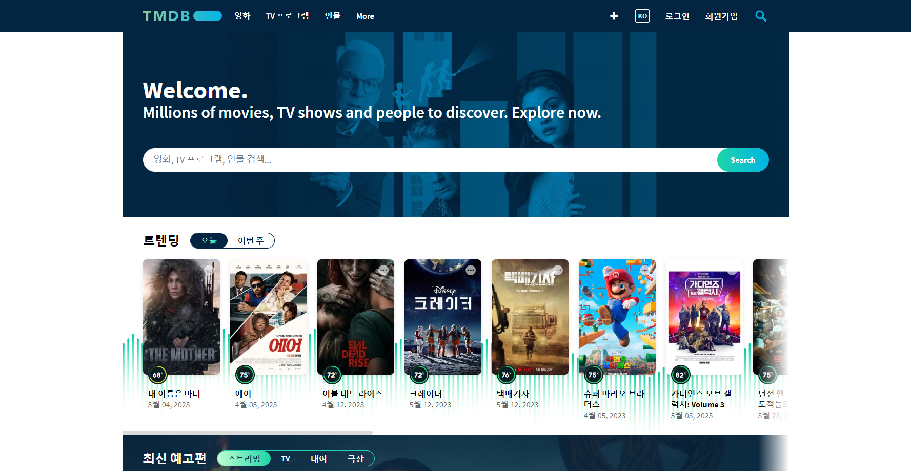

# 2023.05.16

# Vue.js - Vue BootStrap & Vuetify

## TMDB API

### TMDB(The Movie DB)

- [https://www.themoviedb.org/](https://www.themoviedb.org/)



<br>
<br>

### TMDB (The Movie DB) 키 발급

- 로그인 → 프로필 → 설정 → API → Developer → 폼 작성


<br>
<br>

<br>

## Vue BootStrap


<br>
<br>

<br>

## Vuetify


```jsx
vue create my-app

# navigate to new project directory
cd my-app
```

```jsx
vue add vuetify
```
