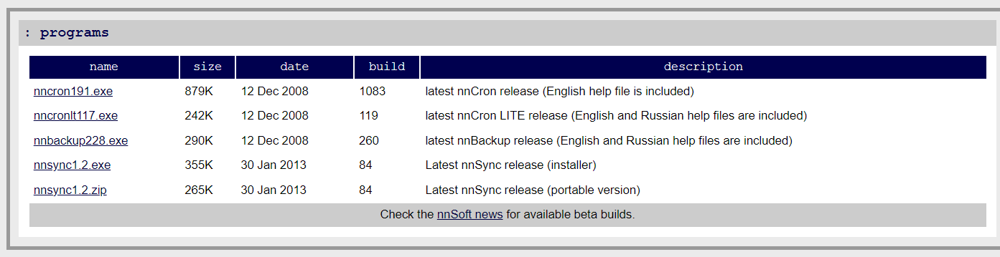

# Cron 사용 방법

### 프로그램 다운로드

[nnSoft: download](http://www.nncron.ru/download.shtml)



- 두번째 파일 설치하였음.


- 다운로드 완료 후 파일 실행.


- 영어 선택


<br>
<br>

### Cron 프로그램 실행

Cron 프로그램을 실행하는 방법은 exe 파일을 실행하지 않고, `[cron.tab](http://cron.tab)` 파일을 수정하는 것으로  실행이 가능하다. `cron.tab` 을 수정하기 위해서는 편집기로 파일을 열어 수정을 하는데, 프로그램을 ‘관리자 권한으로 실행` 해야지만 파일 저장이 가능하다.

- Wordpad를 ‘관리자 권한으로 실행’ 한다
- 워드패드에서 `파일` → `열기` → `C:\Program Files (x86)\cron` 경로에 있는 `[cron.tab](http://cron.tab)` 파일을 열어서 수정하면 된다.!

<br>

<br>

### Cron 사용법

- Cron이 설치된 폴더의 doc\help.chm 참고


✔️ ‘분, 시간, 날짜, 월, 요일’을 설정하여 특정 프로그램을 실행할 수 있게 만드는 프로그램! 

- `Cron.tab`

```
#CRONTAB FILE 
# Classic crontab format:
# Minutes Hours Days Months WeekDays Command

#*/15 8-16 * * 1-5 checkmail.exe
```

✔️ 마지막 줄을 보면 ‘#’으로 해당 라인이 실행되지 않도록 막혀있다. 해당 내용은 Cron Format과 Example을 참고하여 해석해볼 수 있다.

```
#*/15 8-16 * * 1-5 checkmail.exe
```

☑️ 매 15분 마다, 8시~16시 사이에만, 매일, 매월, 월~금요일에 checkmail.exe 파일을 실행하라는 의미! 

<br>

<aside>
💡 이와 같이 우리는 워드패드를 관리자 권한으로 실행하여 [Cron.tab](http://Cron.tab) 파일에 특정 프로그램을 스케쥴링하여 실행할 수 있다.

</aside>
